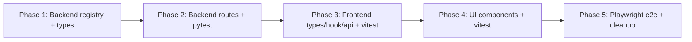

# Plan: Parameterized indicators with per-indicator config form

**Card:** [#111](https://trello.com/c/2PIQgAxM)
**Spec:** `docs/specs/2PIQgAxM-parameterized-indicators.md`
**Branch:** `worktree-feat-parameterized-indicators` (worktree at `.claude/worktrees/feat-parameterized-indicators`)
**Status:** Draft — pending user approval

## Strategy

Land the feature in **5 ordered phases**, each a self-contained green commit on the feature branch. Subagent-driven execution: dispatch one subagent per phase, sequentially (each phase consumes the previous phase's output). Phases 2 and 3 unit-test alongside implementation per [Always test alongside code, never as a follow-up cleanup step](https://trello.com/c/2PIQgAxM) — the orchestration skill calls this out as a Step 5 requirement.

## Phase 1 — Backend indicator type registry

**Goal:** Replace `INDICATOR_REGISTRY` with `INDICATOR_TYPES` and the `ParamSchema` / `IndicatorType` shapes. No route changes yet. No test runs yet (routes still reference old shape; that's Phase 2's problem).

**Files:**
- `packages/server/server/store/indicators.py` — rewrite:
  - Add `ParamSchema` (frozen dataclass with `name`, `type: Literal["int","float"]`, `default`, `min`, `max`, `step`, `label`).
  - Add `IndicatorType` (frozen dataclass with `type`, `label_template`, `display`, `outputs`, `params: tuple[ParamSchema, ...]`, `factory: Callable[[dict], IndicatorProto]`, `update: UpdateFn`).
  - Replace `INDICATOR_REGISTRY: dict[str, IndicatorConfig]` with `INDICATOR_TYPES: dict[str, IndicatorType]`. Entries: SMA, EMA, BB, RSI, MACD, ATR, Stochastics, ZigZag, Donchian, HMA. Distinct param schemas per indicator (e.g. SMA `{period: int, default=20, min=2, max=500}`; ZigZag `{threshold: float, default=0.05, min=0.001, max=0.5, step=0.001}`; MACD `{fast_period: int, default=12}`, `{slow_period: int, default=26}`, `{signal_period: int, default=9}`).
  - Keep the existing `compute_indicator` private helpers (`update_single_value`, `_compute_zigzag`, etc.) — they're shape-compatible since `factory` returns the same `IndicatorProto`.
  - Add `format_label(type_: IndicatorType, params: dict) -> str` that interpolates `label_template`.
  - Add `build_indicator_from_instance(instance: IndicatorInstance) -> IndicatorProto` that validates params against schema and calls `factory`. Raise a typed exception on validation failure.

**Acceptance:**
- `from server.store.indicators import INDICATOR_TYPES` works.
- `INDICATOR_TYPES["SMA"].factory({"period": 20})` returns a `SimpleMovingAverage(period=20)`.
- `format_label(INDICATOR_TYPES["SMA"], {"period": 20}) == "SMA(20)"`.
- Old `INDICATOR_REGISTRY` symbol is gone — any remaining import is updated in Phase 2.

**Subagent prompt outline:** "Rewrite `packages/server/server/store/indicators.py` per spec §3. Keep existing private helpers (`update_*`, `_compute_zigzag`). Export `INDICATOR_TYPES`, `ParamSchema`, `IndicatorType`, `format_label`, `build_indicator_from_instance`. Do not change `routes/indicators.py` in this phase — that's Phase 2."

## Phase 2 — Backend routes + viewer-state + pytest

**Goal:** Make the server work end-to-end against the new registry. New routes for viewer-state. Replace GET with POST for indicator data. Tests pass.

**Files:**
- `packages/server/server/routes/indicators.py` — rewrite:
  - `GET /api/indicators` now returns `IndicatorType` summaries (id, label_template, display, outputs, params schema). Use a Pydantic response model `IndicatorTypeOut`.
  - Replace `GET /api/bars/{bar_type:path}/indicators?ids=...` with `POST /api/bars/{bar_type:path}/indicators` accepting body `IndicatorInstancesBody { instances: list[IndicatorInstance] }`. Returns `list[IndicatorResult]` where each result's `id` is the instance UUID, `label` is `format_label(...)`, `outputs` is the computed series dict, `datetime` is the bar timestamps. Dispatches via `build_indicator_from_instance`.
- `packages/server/server/routes/viewer_state.py` — new:
  - `GET /api/runs/{run_id}/viewer-state` → reads `<catalog>/backtest/{run_id}/viewer_state.json`. Returns `{"indicators": []}` if file missing. Returns 404 if run dir itself doesn't exist (`<catalog>/backtest/{run_id}/config.json` is missing).
  - `PUT /api/runs/{run_id}/viewer-state` → validates body shape, atomic write (write `.tmp` then `os.replace`). Returns 204. 404 if run dir missing. 400 on shape mismatch (Pydantic).
- `packages/server/server/main.py` — register the new router.
- `packages/server/server/schemas.py` (or wherever Pydantic models live) — add `IndicatorInstance`, `IndicatorInstancesBody`, `ViewerState` models.

**Tests (pytest):**
- `packages/server/tests/test_indicators_route.py` (new):
  - `GET /api/indicators` returns the registry with param schemas; SMA has a `period` param with default 20.
  - `POST .../indicators` with `{instances:[{id:"u1", type:"SMA", params:{period:20}}]}` returns one result with `id="u1"`, `label="SMA(20)"`, monotonically computed values for known fixture bars.
  - `POST` with unknown type → 400. Out-of-range param → 400.
- `packages/server/tests/test_viewer_state_route.py` (new):
  - GET missing file → `{"indicators": []}` with run dir present.
  - GET → PUT → GET round-trips.
  - PUT then GET shows new state. Atomic write: no `.tmp` file lingering.
  - Malformed body → 400.
  - Unknown run_id → 404 for both GET and PUT.
- Run all pytest before phase exit: `.venv/bin/python -m pytest tests/ -v`.

**Acceptance:**
- All pytest green in `packages/server`.
- Manually: `curl POST /api/bars/.../indicators` with a real instance returns sane data.

**Subagent prompt outline:** "Implement spec §4 backend routes. Files: `routes/indicators.py` (rewrite, POST replaces GET), `routes/viewer_state.py` (new), `main.py` (register router), schemas. Add pytest coverage matching spec §8. Don't touch frontend."

## Phase 3 — Frontend types, hook, API client + vitest

**Goal:** Wire up the new types, hook, and API methods. Frontend compiles. Unit tests pass for hook + helpers + API. UI components still reference old types — they break in this phase and are fixed in Phase 4. **Strategy:** rather than leave the UI broken, gate the broken component with a no-op stub or comment-out usage from `RunDetailPage` until Phase 4. Confirm with `bunx tsc --noEmit` that the rest of the code compiles before exit.

**Files:**
- `packages/client/src/types/api.ts` — add `ParamSchema`, `IndicatorType`, `IndicatorInstance` types per spec §6. Update `IndicatorMeta` → either rename to `IndicatorType` and search-replace consumers, or keep as an alias. Update `IndicatorResult` if needed (it stays the same shape; `id` is now the instance UUID).
- `packages/client/src/lib/api.ts`:
  - Add `fetchIndicatorTypes(): Promise<IndicatorType[]>`.
  - Replace `getIndicatorResult(barType, ids[])` with `fetchIndicatorData(barType, instances: IndicatorInstance[]): Promise<IndicatorResult[]>` (POST body).
  - Add `fetchViewerState(runId): Promise<{indicators: IndicatorInstance[]}>`.
  - Add `putViewerState(runId, payload): Promise<void>`.
- `packages/client/src/lib/indicator-params.ts` (new):
  - `validateParams(schema: ParamSchema[], params: Record<string,number>) → ValidationResult` (errors per field).
  - `coerceParams(schema, raw: Record<string,string>) → Record<string,number>` (string inputs → typed numbers, respecting `type: int|float`).
  - `defaultParams(schema) → Record<string,number>`.
  - `formatLabel(type: IndicatorType, params) → string` (mirror backend `format_label`).
- `packages/client/src/lib/indicator-params.test.ts` (new — vitest):
  - Defaults populate every schema field.
  - Validation: out-of-range, wrong type, missing required, edge values.
  - Coerce: `"20"` → `20` for int, `"0.05"` → `0.05` for float, NaN handling.
  - Format: `formatLabel(SMA, {period:20}) === "SMA(20)"`.
- `packages/client/src/lib/uuid.ts` (new): tiny `newInstanceId(): string` wrapping `crypto.randomUUID()`. Has a fallback for non-crypto contexts.
- `packages/client/src/lib/uuid.test.ts` (new — vitest): generates distinct ids; format check.
- `packages/client/src/hooks/use-indicators.ts` — rewrite:
  - Signature: `useIndicators(runId: string, barType: string)`.
  - State: `instances: IndicatorInstance[]` (not a Set).
  - Initial load: `useQuery(['viewer-state', runId], fetchViewerState)`. On success, seed local state once.
  - Mutations: `addInstance(type, params) → newId`, `editInstance(id, params)`, `removeInstance(id)`.
  - Debounced flush: after any mutation, schedule a single `putViewerState` 300 ms later (cancel pending on new mutation). Use a ref-based timer.
  - Data fetch: `useQuery(['indicator-data', barType, hashInstances(instances)], () => fetchIndicatorData(barType, instances))`, `enabled: instances.length > 0 && !!barType`.
  - Return: `{ types, instances, data, addInstance, editInstance, removeInstance, getColor, setColor }` (colors stay localStorage-keyed by instance UUID).
- `packages/client/src/hooks/use-indicators.test.ts` (new — vitest):
  - Mock fetch (vitest's `vi.spyOn(global, 'fetch')` or whatever the project's pattern is).
  - On mount, GET viewer-state fires; instances populate.
  - `addInstance` updates state immediately; PUT fires after 300 ms; rapid edits debounce to one PUT.
  - `editInstance` updates by id, preserves color slot.
  - `removeInstance` drops by id.

**Acceptance:**
- `bunx tsc --noEmit` clean.
- `bun run test:unit` green (vitest).
- `packages/client/src/components/chart/indicator-selector/IndicatorSelector.tsx` either:
  - exports the same shape (best effort), OR
  - is stubbed/commented out from `RunDetailPage` with a `// TODO Phase 4` and a brief skeleton. Browser may render without the toggle UI temporarily.

**Subagent prompt outline:** "Implement spec §6 frontend types, hook, API client, helpers, vitest. Don't touch the UI components — that's Phase 4. Stub out broken consumers if needed so tsc stays clean."

## Phase 4 — UI components + vitest

**Goal:** Build the new `IndicatorInstanceSelector` and its sub-components. Re-wire `RunDetailPage`. UI is fully functional.

**Files:**
- `packages/client/src/components/chart/indicator-selector/IndicatorSelector.tsx` — rewrite (rename to `IndicatorInstanceSelector` and re-export under both names for one phase if it eases the rename; or rename outright and update import).
  - Renders one chip per instance via `IndicatorChip`.
  - Renders a `+` button that opens an `AddIndicatorPopover` anchored to the button.
- `packages/client/src/components/chart/indicator-selector/IndicatorChip.tsx` (new):
  - Props: `{ instance, label, color, onEdit(id), onRemove(id), onColorChange(id, c) }`.
  - Renders: `[ label ✎ × ]` with a small swatch.
- `packages/client/src/components/chart/indicator-selector/AddIndicatorPopover.tsx` (new):
  - Props: `{ types, onSubmit(type, params), onCancel }`.
  - Two-stage popover: stage 1 list of indicator types; stage 2 (after pick) renders `IndicatorParamForm`.
  - Uses shadcn `Popover` for anchoring.
- `packages/client/src/components/chart/indicator-selector/IndicatorParamForm.tsx` (new):
  - Props: `{ type, initialParams?, submitLabel, onSubmit(params), onCancel }`.
  - Renders one input per `ParamSchema` (number input with `min`/`max`/`step` HTML attrs).
  - Local state holds raw string values; on submit, `coerceParams` + `validateParams`; show inline errors; disable submit while invalid.
  - On mount, seeds from `initialParams ?? defaultParams(type.params)`.
- `packages/client/src/components/chart/indicator-selector/IndicatorParamForm.test.tsx` (new — vitest + `@testing-library/react`):
  - Defaults populated for create mode.
  - Edit mode: passing `initialParams` seeds inputs.
  - Submit disabled when a field is invalid (out-of-range); enabled when valid.
  - Submit calls `onSubmit` with coerced numeric params.
  - Cancel calls `onCancel`.
- `packages/client/src/pages/RunDetailPage.tsx` — pass `runId` into `useIndicators(runId, barType)`. Replace the old `IndicatorSelector` JSX with the new `IndicatorInstanceSelector`, wiring `addInstance` (called from `AddIndicatorPopover.onSubmit`), `editInstance`, `removeInstance` from the hook.

**Project conventions:**
- React functional components only — no classes (per global CLAUDE.md).
- Custom hooks for any non-trivial state.
- shadcn/ui components; neutral theme.

**Tests:**
- `bun run test:unit` (vitest) — all phase tests + Phase 3 tests still green.
- `bunx tsc --noEmit` clean.
- ESLint clean.

**Acceptance:**
- Manually launch worktree dev servers (`WORKTREE_CLIENT_PORT=5174`, `WORKTREE_SERVER_PORT=8001`), open the page, see chips for any previously-saved instances; click `+` → see type list → pick SMA → see param form → submit → see new chip and an overlay on the chart; click `✎` on a chip → form prefilled → change → save → chart updates; reload → state persists.

**Subagent prompt outline:** "Implement spec §7 UI components per Phase 4. Wire `RunDetailPage`. Add vitest coverage for `IndicatorParamForm`. Don't write Playwright tests — that's Phase 5."

## Phase 5 — Playwright e2e + housekeeping

**Goal:** Lock the user journey behind a regression test. Smoke check. Clean up any stray imports.

**Files:**
- `packages/client/e2e/parameterized-indicators.spec.ts` (new):
  - Fixture: a known run_id from `packages/client/e2e/test-data/` (use whatever the existing e2e tests use).
  - Steps:
    1. Navigate to `/runs/<run_id>`.
    2. Wait for the chart to be ready (existing helper).
    3. Click `+` → click `SMA` → fill period `20` → click `Add`.
    4. Assert a chip labeled `SMA(20)` is visible and the chart has one overlay series.
    5. Click `✎` on the chip → change period to `30` → click `Save`. Assert chip is now `SMA(30)`.
    6. Click `+` → `SMA` → period `50` → `Add`. Assert two chips: `SMA(30)`, `SMA(50)`.
    7. Click `×` on `SMA(30)`. Assert only `SMA(50)` remains.
    8. Reload page. Assert `SMA(50)` chip reappears (persistence round-trip).
  - **No timeouts.** Wait for async state — `expect(...).toBeVisible()` with auto-waits.
- Run headless first: `TEST_VITE_PORT=5174 TEST_API_PORT=8001 npx playwright test parameterized-indicators.spec.ts --project=headless`.
- Clean up any TODO comments / stubs left from Phase 3.
- Final lint + tsc + unit + e2e all green.

**Acceptance:**
- Playwright spec passes headless and in UI mode.
- `bunx tsc --noEmit`, `bun run test:unit`, ESLint, ruff, pytest all green.

**Subagent prompt outline:** "Write Playwright e2e per spec §8 and Plan Phase 5. Use existing test fixture run_id. No timeouts — wait for async state. Run headless to verify."

## Risks + mitigations

| Risk | Mitigation |
|---|---|
| Frontend broken between Phase 3 and Phase 4 (UI references old types) | Phase 3 stubs out the consumer in `RunDetailPage` with a `// TODO Phase 4` so tsc stays clean. Phase 4 wires it back. |
| `INDICATOR_REGISTRY` consumers elsewhere in the codebase | Phase 1 subagent must grep for `INDICATOR_REGISTRY` across the repo and update every consumer (likely only `routes/indicators.py`, which Phase 2 owns). |
| Atomic write on Windows | Backend uses `os.replace` (atomic on POSIX *and* Windows per Python docs); spec says `os.rename` but `os.replace` is the correct primitive. Plan supersedes spec on this micro-detail. |
| Debounced PUT racing with unmount | Hook's flush effect must cleanup-cancel on unmount and fire the pending PUT once via `useEffect` cleanup. Test covers this. |
| Existing color UI still keyed by old preset id | Color storage migrates to instance UUID. Old colors become dead — accepted per spec §9. Hook's `getColor`/`setColor` use the UUID. |
| ZigZag display = panel vs overlay | `display` is on `IndicatorType` (not on the instance), so frontend dispatching by type works unchanged. |

## Out of scope (reaffirmed)

- Postgres-backed storage (card #129).
- Server-side color persistence (card #129).
- Panel layout persistence (card #129).
- Indicator math changes.
