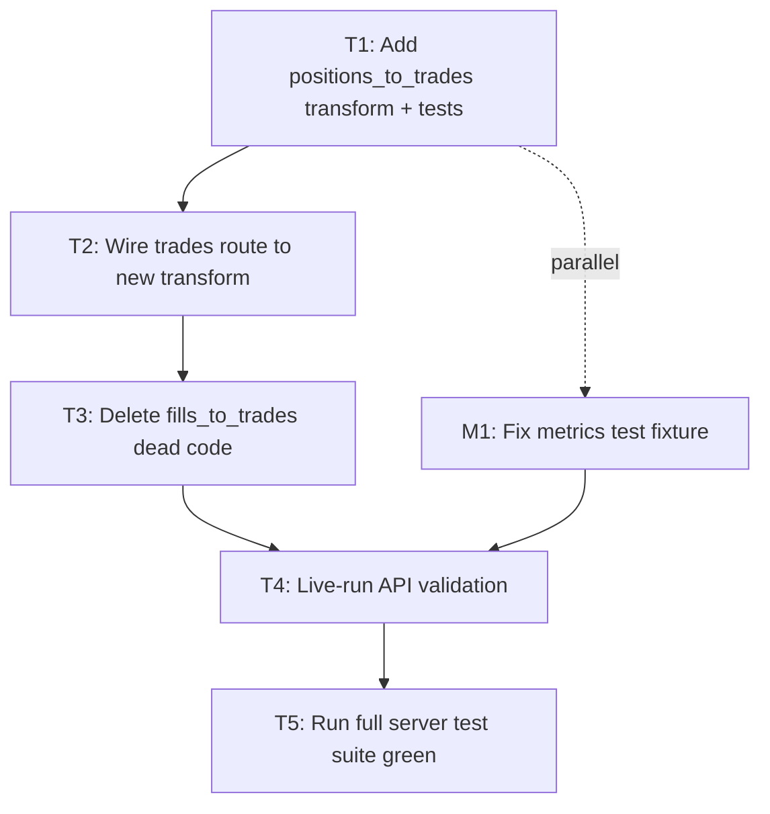

# Plan — Trades from Positions + fix `compute_run_metrics` test/impl mismatch

**Trello:** https://trello.com/c/Ty1ZvebC
**Spec:** `docs/specs/trades-from-positions.md` on `fix/trades-from-positions` @ `1448b77`
**Branch:** `fix/trades-from-positions`

## Order of work



T1 + M1 are independent and can be dispatched in parallel. T2 depends on T1. T3 follows T2 (so the route doesn't dangle before the function is gone). T4 + T5 are the verification at the end.

## Task list

### T1 — Add `positions_to_trades` transform with unit tests

**File:** `packages/server/server/store/transforms.py`

**Change:**

1. Add this import at the top alongside the existing imports:
   ```python
   from nautilus_trader.model.enums import OrderSide
   ```
2. Insert `positions_to_trades` immediately above the existing `fills_to_trades` function (the dead one is deleted in T3, so this lands as a sibling first):

   ```python
   def positions_to_trades(positions_closed: list) -> list[dict]:
       """Convert closed Positions into trade rows for the UI table.

       One closed Position = one trade. Under NETTING OMS multiple closed
       Positions can share a position_id; each is still its own trade row.
       """
       sorted_positions = sorted(positions_closed, key=lambda p: p.ts_opened)
       return [
           {
               "relative_id": idx + 1,
               "position_id": str(p.position_id),
               "instrument_id": str(p.instrument_id),
               "direction": "Long" if p.entry == OrderSide.BUY else "Short",
               "entry_datetime": _ns_to_iso(p.ts_opened),
               "entry_price": float(p.avg_px_open),
               "exit_datetime": _ns_to_iso(p.ts_closed),
               "exit_price": float(p.avg_px_close),
               "quantity": float(p.peak_qty),
               "pnl": round(float(p.realized_pnl), 2),
               "currency": str(p.currency),
           }
           for idx, p in enumerate(sorted_positions)
       ]
   ```

**Tests:** `packages/server/tests/test_transforms.py` (create the file if it doesn't exist; otherwise extend it).

Shared fixture helper at module level:

```python
from types import SimpleNamespace
from nautilus_trader.model.enums import OrderSide

_BASE_TS = 1_704_067_200_000_000_000  # 2024-01-01 00:00:00 UTC
_1H_NS = 3_600_000_000_000
_1D_NS = 86_400_000_000_000


def _mk_pos(
    *,
    position_id="P-0",
    ts_opened=_BASE_TS,
    ts_closed=_BASE_TS + _1H_NS,
    entry=OrderSide.BUY,
    avg_px_open=100.0,
    avg_px_close=110.0,
    peak_qty=1.0,
    realized_pnl=10.0,
    currency="USD",
    instrument_id="XAUUSD.IBCFD",
):
    return SimpleNamespace(
        position_id=position_id,
        instrument_id=instrument_id,
        entry=entry,
        ts_opened=ts_opened,
        ts_closed=ts_closed,
        avg_px_open=avg_px_open,
        avg_px_close=avg_px_close,
        peak_qty=peak_qty,
        realized_pnl=realized_pnl,
        currency=currency,
    )
```

Five tests:

- **`test_positions_to_trades_one_per_closed_position`** — three positions sharing `position_id="P-NETTING"` with distinct `ts_opened` produce 3 trade rows with `relative_id` 1/2/3 and matching pnl/entry/exit timestamps. This is the regression test for the NETTING-OMS bug.
- **`test_positions_to_trades_unique_position_ids`** — three positions with unique `position_id`s produce 3 trade rows; same shape as the NETTING case. Proves HEDGING-OMS still works.
- **`test_positions_to_trades_sorted_by_ts_opened`** — input list intentionally out of order (ts_opened: T+2, T, T+1) yields rows in ascending order with `relative_id` 1/2/3.
- **`test_positions_to_trades_direction`** — two positions, entry=`OrderSide.BUY` → `"Long"`, entry=`OrderSide.SELL` → `"Short"`. Catches the latent direction bug from the deleted transform.
- **`test_positions_to_trades_empty`** — `positions_to_trades([])` returns `[]`.

**Definition of done:** `uv run pytest tests/test_transforms.py -q` passes; the 5 tests above are present and green.

### M1 — Fix `compute_run_metrics` test fixture (parallel with T1)

**File:** `packages/server/tests/test_metrics.py`

**Change:**

1. Remove `import pyarrow as pa`; add `from types import SimpleNamespace`.
2. Replace `_make_positions_table` with `_make_positions_list`. Same signature; returns `list[SimpleNamespace]` with attributes the impl needs (`realized_pnl`, `realized_return`, `ts_opened`, `ts_closed`, `duration_ns`, `position_id`):

   ```python
   def _make_positions_list(
       realized_pnl: list[float],
       ts_opened: list[int] | None = None,
       ts_closed: list[int] | None = None,
       duration_ns: list[int] | None = None,
   ) -> list:
       n = len(realized_pnl)
       if ts_opened is None:
           ts_opened = [_BASE_TS + i * _1D_NS for i in range(n)]
       if ts_closed is None:
           ts_closed = [_BASE_TS + i * _1D_NS + _1H_NS for i in range(n)]
       if duration_ns is None:
           duration_ns = [_1H_NS] * n
       return [
           SimpleNamespace(
               realized_pnl=realized_pnl[i],
               realized_return=0.01,
               ts_opened=ts_opened[i],
               ts_closed=ts_closed[i],
               duration_ns=duration_ns[i],
               position_id=f"P-{i}",
           )
           for i in range(n)
       ]
   ```

3. In every test that called `_make_positions_table(...)`, rename to `_make_positions_list(...)`. The 20 failing tests are:
   - `test_total_pnl_sum`, `test_total_pnl_rounded_to_2_decimals`
   - `test_wins_count`, `test_losses_count`
   - `test_win_rate`, `test_win_rate_rounded_to_4_decimals`
   - `test_avg_win`, `test_avg_loss`, `test_avg_loss_includes_zero_pnl`
   - `test_win_loss_ratio`, `test_win_loss_ratio_none_when_avg_loss_zero`
   - `test_expectancy_calculation`
   - `test_avg_hold_hours`, `test_avg_hold_hours_rounded_to_1`
   - `test_pnl_per_week`, `test_trades_per_week`
   - `test_sharpe_ratio_in_compute_run_metrics`
   - `test_all_winning_trades_no_avg_loss`, `test_all_losing_trades_no_avg_win`
   - `test_single_trade`
4. Rename `test_empty_table_returns_all_none` → `test_empty_list_returns_all_none`. The body changes from passing an empty `pa.table({...})` to passing `[]`.

**Do not modify** `packages/server/server/store/metrics.py`. The impl already handles the object-with-attributes shape; production passes `list[PositionClosed]`.

**Definition of done:** `uv run pytest tests/test_metrics.py -q` shows 89 passed (the previously-failing 20 now green plus the 69 that were already green).

### T2 — Wire trades route to `positions_to_trades`

**File:** `packages/server/server/routes/fills.py`

**Change:** the `get_trades` handler currently sources from `get_fills(data)` and calls `fills_to_trades`. Switch it to:

```python
from server.store.catalog_reader import get_positions_closed, read_backtest_data
from server.store.transforms import positions_to_trades
# ... existing decorator/function signature unchanged ...
data = read_backtest_data(catalog, run_id)
positions = get_positions_closed(data)
return positions_to_trades(positions)
```

Drop any leftover `fills`/`get_fills` reference from this handler (other handlers in the file that need fills are unaffected).

**Definition of done:** `uv run pytest tests/ -q` still passes; `grep fills_to_trades packages/server/server/routes/` returns nothing.

### T3 — Delete `fills_to_trades` dead code

**File:** `packages/server/server/store/transforms.py`

**Change:** delete the `fills_to_trades` function (was around lines 60–105). Also remove any helper imports it pulled in if they're unused after the deletion. Do not delete `fills_to_dicts` — that's still used by the `/fills` endpoint.

**Definition of done:** `grep -rn "fills_to_trades" packages/server` returns no hits.

### T4 — Live-run API validation

After T1–T3 + M1 land, start the worktree dev server (Step 7 will formalize this; for validation here, a one-off `uv run uvicorn server.main:app --port $WORKTREE_SERVER_PORT` is sufficient if it isn't already running). Then:

```bash
# Trade count parity with positions
A=$(curl -sf "http://localhost:$WORKTREE_SERVER_PORT/api/runs/fbaf897e-db90-4c15-9445-97ee39c67408/trades" | jq 'length')
B=$(curl -sf "http://localhost:$WORKTREE_SERVER_PORT/api/runs/fbaf897e-db90-4c15-9445-97ee39c67408" | jq '.total_positions')
test "$A" = "$B" && echo "fbaf897e: $A trades = $B positions ✓"

A=$(curl -sf "http://localhost:$WORKTREE_SERVER_PORT/api/runs/e4599dab-fd51-4758-9564-c2061bc2104e/trades" | jq 'length')
B=$(curl -sf "http://localhost:$WORKTREE_SERVER_PORT/api/runs/e4599dab-fd51-4758-9564-c2061bc2104e" | jq '.total_positions')
test "$A" = "$B" && echo "e4599dab: $A trades = $B positions ✓"
```

Expected: 238 trades for `fbaf897e-…`, 204 trades for `e4599dab-…`.

Spot-check three random trade rows per run against the corresponding `/positions` row by `ts_opened` for `pnl`, `entry_price`, `exit_price`. They should match exactly (Nautilus's `realized_pnl` is what we expose; `avg_px_open`/`avg_px_close` flow through `float()` unchanged).

Direction sanity check: at least one row should be `"Long"` somewhere in the 238-row response (the BBB run had BUY-entry round-trips). Confirms the latent direction bug is fixed.

**Definition of done:** both counts match, spot-checks agree, at least one `"Long"` direction observed.

### T5 — Full server test suite green

```bash
cd packages/server
uv run pytest tests/ -q
```

Expected: 89 passed (or higher if any new tests beyond T1's 5 land), 0 failed.

**Definition of done:** test suite exits 0 with no failures.

## Subagent dispatch plan (Step 5)

Step 5 of the orchestration uses subagent-driven execution. Recommended split:

- **Subagent A** (Sonnet): T1 + T3 + T2 (sequential within the same agent — write transform, switch route, delete old function — they touch overlapping files and ordering matters).
- **Subagent B** (Sonnet): M1 (independent file; can run in parallel with A).
- **Inline (orchestrator)**: T4 and T5 — quick verification calls, no need to dispatch.

Each subagent gets the relevant section of this plan plus the spec file path as context.

## Acceptance criteria coverage map

| Criterion | Where verified |
|---|---|
| `/api/runs/{id}/trades` returns `len(trades) == total_positions` | T4 |
| Each trade exposes the same JSON keys `TradeTable.tsx` consumes | T1 (test asserts shape), T4 (live) |
| `fbaf897e-…` returns 238 trades; `e4599dab-…` returns 204 trades | T4 |
| Trade `#` column counts 1..N (ordered by `ts_opened` ascending) | T1 (`test_positions_to_trades_sorted_by_ts_opened`), T4 |
| NETTING-OMS: shared `position_id` → N trades | T1 (`test_positions_to_trades_one_per_closed_position`) |
| HEDGING-OMS: unique `position_id` per round-trip | T1 (`test_positions_to_trades_unique_position_ids`) |
| Open positions at backtest end excluded | T2 (route uses `get_positions_closed`) |
| `TradeTable.tsx` unchanged | T1 (test fixture asserts JSON keys; no client edits in any task) |
| 20 currently-failing `tests/test_metrics.py` tests pass | M1 + T5 |
| Full `packages/server` test suite green | T5 |

## Out of scope (reaffirmed from spec)

- No changes to `packages/client/`.
- No changes to `packages/server/server/store/metrics.py` (impl).
- No `pa.Table` migration of metrics.
- No new endpoints, no fills-drilldown UI.

## Open questions

None. All field names verified against `nautilus_trader.model.events.position.PositionClosed` and the existing `positions_closed_to_dicts` transform.
