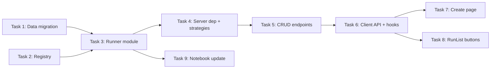

# Backtest CRUD Implementation Plan

> **For agentic workers:** REQUIRED SUB-SKILL: Use superpowers:subagent-driven-development (recommended) or superpowers:executing-plans to implement this plan task-by-task. Steps use checkbox (`- [ ]`) syntax for tracking.

**Goal:** Add backtest lifecycle management — create, rerun, delete — using NautilusTrader's canonical `BacktestNode` + `BacktestRunConfig` pattern, backed by a proper data catalog.

**Architecture:** Migrate bar data into NautilusTrader's `ParquetDataCatalog` format (`data/bar/`, `data/instrument/`). The runner module is a thin wrapper: build a `BacktestRunConfig` from user inputs → `BacktestNode([config]).run()`. Rerun = reload saved config → run again. The server exposes CRUD endpoints; the frontend provides a create form and rerun/delete buttons. Two catalog directories: `data/` (source market data) and `backtest/` (run results).

**Tech Stack:** Python 3.12+ (FastAPI, NautilusTrader, pyarrow, msgspec), TypeScript (React, Effect-TS, React Query, Tabulator, shadcn/ui, wouter)

---

## Catalog Architecture

```
backtest_catalog/
├── data/                              ← SOURCE DATA (market data, instruments)
│   ├── bar/
│   │   └── XAUUSD.IBCFD-1-MINUTE-MID-EXTERNAL/
│   │       └── *.parquet              ← Written via catalog.write_data()
│   └── instrument/
│       └── XAU_USD.SIM/
│           └── *.parquet              ← Instrument definition
└── backtest/                          ← RESULTS (auto-written by StreamingConfig)
    └── {run_id}/
        ├── config.json                ← Engine config + BacktestRunConfig JSON
        ├── order_filled_0.feather
        ├── position_opened_0.feather
        ├── position_closed_0.feather
        ├── account_state_0.feather
        └── bar/{bar_type}/*.feather
```

**Key separation:** `data/` is curated input. `backtest/` is generated output. BacktestNode reads from `data/`, StreamingConfig writes to `backtest/`.

---

## File Structure

```
packages/runner/runner/
  backtest.py          (NEW)  — build_run_config() + run_backtest() using BacktestNode
  registry.py          (NEW)  — strategy name → ImportableStrategyConfig mapping
  migrate.py           (NEW)  — one-time migration script: feather → ParquetDataCatalog
packages/runner/tests/
  test_backtest.py     (NEW)  — tests for config building
  test_registry.py     (NEW)  — tests for registry
packages/server/server/
  pyproject.toml       (MOD)  — add runner dependency
  routes/runs.py       (MOD)  — add POST /runs, POST /runs/{id}/rerun, DELETE /runs/{id}
  routes/strategies.py (NEW)  — GET /strategies
  store/reader.py      (MOD)  — add delete_run()
  store/transforms.py  (MOD)  — use enriched config for strategy name
  main.py              (MOD)  — register strategies router
packages/client/src/
  types/api.ts         (MOD)  — add Strategy, CreateBacktestRequest types
  lib/api.ts           (MOD)  — add create/rerun/delete + POST/DELETE helpers
  lib/run-columns.ts   (MOD)  — add rerun/delete action columns
  pages/CreateBacktestPage.tsx  (NEW)  — backtest creation form
  hooks/use-strategies.ts       (NEW)  — fetch strategies
  hooks/use-mutations.ts        (NEW)  — create/rerun/delete mutations
  App.tsx              (MOD)  — add /create route
  components/runs/RunList.tsx   (MOD) — pass action callbacks
```

---

### Task 1: Data migration — populate ParquetDataCatalog

**Files:**
- Create: `packages/runner/runner/migrate.py`

This is a one-time script to copy existing bar data from `backtest/{run_id}/bar/` into `data/bar/` using `ParquetDataCatalog.write_data()`, and write the XAUUSD instrument definition to `data/instrument/`.

- [ ] **Step 1: Write the migration script**

```python
# packages/runner/runner/migrate.py
"""One-time migration: copy bar data and instruments into ParquetDataCatalog format.

Usage:
    cd packages/runner
    uv run python -m runner.migrate /path/to/backtest_catalog
"""

import sys
from pathlib import Path

import pyarrow.ipc as ipc

from nautilus_trader.model.data import Bar
from nautilus_trader.persistence.catalog import ParquetDataCatalog
from nautilus_trader.serialization.arrow.serializer import ArrowSerializer

from runner.registry import INSTRUMENTS


def migrate_catalog(catalog_path: str) -> None:
    """Migrate bar data from backtest/ into data/ and write instrument definitions."""
    root = Path(catalog_path)
    catalog = ParquetDataCatalog(str(root))

    # 1. Write instrument definitions
    for name, factory in INSTRUMENTS.items():
        instrument = factory()
        catalog.write_data([instrument])
        print(f"Wrote instrument: {instrument.id}")

    # 2. Find and migrate bar data from backtest runs
    backtest_dir = root / "backtest"
    if not backtest_dir.exists():
        print("No backtest/ directory found")
        return

    seen_bar_types: set[str] = set()

    for run_dir in sorted(backtest_dir.iterdir()):
        if not run_dir.is_dir():
            continue
        bar_dir = run_dir / "bar"
        if not bar_dir.exists():
            continue

        for bar_type_dir in bar_dir.iterdir():
            if not bar_type_dir.is_dir():
                continue
            bar_type_name = bar_type_dir.name
            if bar_type_name in seen_bar_types:
                continue  # Already migrated this bar type

            # Read all feather files for this bar type
            all_bars: list[Bar] = []
            for feather_file in sorted(bar_type_dir.glob("*.feather")):
                with open(feather_file, "rb") as f:
                    reader = ipc.open_stream(f)
                    table = reader.read_all()
                bars = ArrowSerializer.deserialize(Bar, table)
                all_bars.extend(bars)

            if all_bars:
                # Sort by timestamp (required by write_data)
                all_bars.sort(key=lambda b: b.ts_init)
                catalog.write_data(all_bars)
                seen_bar_types.add(bar_type_name)
                print(f"Migrated {len(all_bars)} bars for {bar_type_name}")

    print(f"\nMigration complete. {len(seen_bar_types)} bar types migrated.")
    print(f"Data written to: {root / 'data'}")


if __name__ == "__main__":
    if len(sys.argv) != 2:
        print(f"Usage: python -m runner.migrate <catalog_path>")
        sys.exit(1)
    migrate_catalog(sys.argv[1])
```

- [ ] **Step 2: Run the migration**

```bash
cd packages/runner
uv run python -m runner.migrate ../../backtest_catalog
```

Expected output:
```
Wrote instrument: XAU/USD.SIM
Migrated N bars for XAUUSD.IBCFD-1-MINUTE-MID-EXTERNAL
Migrated N bars for XAUUSD.IBCFD-5-MINUTE-MID-EXTERNAL
Migration complete. 2 bar types migrated.
```

- [ ] **Step 3: Verify the data catalog exists**

```bash
ls ../../backtest_catalog/data/bar/
ls ../../backtest_catalog/data/instrument/
```

Expected: directories with parquet files.

- [ ] **Step 4: Verify ParquetDataCatalog can query it**

```bash
cd packages/runner && uv run python -c "
from nautilus_trader.persistence.catalog import ParquetDataCatalog
from nautilus_trader.model.data import Bar

catalog = ParquetDataCatalog('../../backtest_catalog')
instruments = catalog.instruments()
print(f'Instruments: {[str(i.id) for i in instruments]}')

bars = catalog.query(Bar)
print(f'Total bars: {len(bars)}')
print(f'First bar: {bars[0]}')
"
```

- [ ] **Step 5: Commit**

```bash
git add packages/runner/runner/migrate.py
git commit -m "feat: add data migration script for ParquetDataCatalog format"
```

Note: `backtest_catalog/data/` is gitignored (under `backtest_catalog/`), so only the script is committed.

---

### Task 2: Strategy registry

**Files:**
- Create: `packages/runner/runner/registry.py`
- Create: `packages/runner/tests/test_registry.py`

- [ ] **Step 1: Write the registry**

```python
# packages/runner/runner/registry.py
"""Registry of available strategies for backtesting."""

STRATEGIES = {
    "BBBStrategy": {
        "label": "Bollinger Band Breakout",
        "strategy_path": "strategies.bbb_strategy.BBBStrategy",
        "config_path": "strategies.bbb_strategy.BBBStrategyConfig",
        "default_params": {
            "trade_size": "1",
            "buy_array_kind": "close",
            "buy_band_kind": "top",
            "buy_period": 20,
            "buy_sd": 2.0,
            "sell_array_kind": "close",
            "sell_band_kind": "top",
            "sell_period": 20,
            "sell_sd": 3.0,
            "frequency_bars": 10,
            "signal_variant": "baseline",
            "ma_trend_kind": "normal",
            "close_positions_on_stop": True,
        },
    },
}


def get_strategy_info(name: str) -> dict:
    """Get strategy registry entry. Raises KeyError if not found."""
    return STRATEGIES[name]
```

- [ ] **Step 2: Write tests**

```python
# packages/runner/tests/test_registry.py
import pytest

from runner.registry import STRATEGIES, get_strategy_info


def test_strategies_registry_has_bbb():
    assert "BBBStrategy" in STRATEGIES
    assert STRATEGIES["BBBStrategy"]["label"] == "Bollinger Band Breakout"


def test_get_strategy_info_returns_bbb():
    info = get_strategy_info("BBBStrategy")
    assert info["strategy_path"] == "strategies.bbb_strategy.BBBStrategy"
    assert info["config_path"] == "strategies.bbb_strategy.BBBStrategyConfig"
    assert "default_params" in info


def test_get_strategy_info_unknown_raises():
    with pytest.raises(KeyError):
        get_strategy_info("NonExistent")


def test_default_params_complete():
    info = get_strategy_info("BBBStrategy")
    params = info["default_params"]
    assert params["trade_size"] == "1"
    assert params["buy_sd"] == 2.0
    assert params["sell_sd"] == 3.0
    assert params["frequency_bars"] == 10
```

- [ ] **Step 3: Run tests**

```bash
cd packages/runner && uv run pytest tests/test_registry.py -v
```

Expected: 4 tests pass.

- [ ] **Step 4: Commit**

```bash
git add packages/runner/runner/registry.py packages/runner/tests/test_registry.py
git commit -m "feat: add strategy registry"
```

---

### Task 3: Backtest runner module using BacktestNode

**Files:**
- Create: `packages/runner/runner/backtest.py`
- Create: `packages/runner/tests/test_backtest.py`

- [ ] **Step 1: Write the runner module**

```python
# packages/runner/runner/backtest.py
"""Backtest execution using NautilusTrader's BacktestNode.

Usage from notebook:
    config = build_run_config("BBBStrategy", "XAUUSD.IBCFD-1-MINUTE-MID-EXTERNAL", catalog_path, params={...})
    result = run_backtest(config)

Usage from server:
    Same — build config from API request, call run_backtest().
"""

import json
from pathlib import Path

import msgspec
from nautilus_trader.backtest.config import (
    BacktestDataConfig,
    BacktestEngineConfig,
    BacktestRunConfig,
    BacktestVenueConfig,
)
from nautilus_trader.backtest.node import BacktestNode
from nautilus_trader.backtest.results import BacktestResult
from nautilus_trader.config import LoggingConfig
from nautilus_trader.persistence.config import StreamingConfig
from nautilus_trader.trading.config import ImportableStrategyConfig

from runner.registry import get_strategy_info


def build_run_config(
    strategy_name: str,
    bar_type: str,
    catalog_path: str,
    params: dict | None = None,
    starting_balance: str = "100000 USD",
    log_level: str = "WARNING",
) -> BacktestRunConfig:
    """Build a complete BacktestRunConfig from user inputs.

    Args:
        strategy_name: Registry key, e.g. "BBBStrategy".
        bar_type: Full bar type string, e.g. "XAUUSD.IBCFD-1-MINUTE-MID-EXTERNAL".
        catalog_path: Path to the data catalog (reads data/ for bars, writes backtest/ for results).
        params: Strategy parameter overrides (merged over defaults).
        starting_balance: Starting balance string, e.g. "100000 USD".
        log_level: NautilusTrader log level.

    Returns:
        A fully configured BacktestRunConfig ready for BacktestNode.
    """
    info = get_strategy_info(strategy_name)

    # Merge user params over defaults
    merged_params = {**info["default_params"], **(params or {})}

    # Parse instrument_id and bar_spec from bar_type
    # e.g. "XAUUSD.IBCFD-1-MINUTE-MID-EXTERNAL" → instrument "XAUUSD.IBCFD", bar_spec parsed by NautilusTrader
    instrument_id = bar_type.split("-")[0]  # e.g. "XAUUSD.IBCFD"

    # Add instrument_id and bar_type to strategy params (required by BBBStrategyConfig)
    merged_params["instrument_id"] = instrument_id
    merged_params["bar_type"] = bar_type

    strategy_config = ImportableStrategyConfig(
        strategy_path=info["strategy_path"],
        config_path=info["config_path"],
        config=merged_params,
    )

    venue_config = BacktestVenueConfig(
        name="SIM",
        oms_type="NETTING",
        account_type="MARGIN",
        starting_balances=[starting_balance],
    )

    data_config = BacktestDataConfig(
        catalog_path=catalog_path,
        data_cls="nautilus_trader.model.data:Bar",
        instrument_id=instrument_id,
    )

    engine_config = BacktestEngineConfig(
        strategies=[strategy_config],
        logging=LoggingConfig(log_level=log_level),
        streaming=StreamingConfig(
            catalog_path=catalog_path,
            replace_existing=False,
        ),
    )

    return BacktestRunConfig(
        venues=[venue_config],
        data=[data_config],
        engine=engine_config,
    )


def run_backtest(config: BacktestRunConfig) -> BacktestResult:
    """Execute a backtest using NautilusTrader's BacktestNode.

    Args:
        config: A BacktestRunConfig (built via build_run_config or loaded from JSON).

    Returns:
        BacktestResult with stats, P&L, run metadata.
    """
    node = BacktestNode(configs=[config])
    results = node.run()
    return results[0]


def save_run_config(config: BacktestRunConfig, catalog_path: str, run_id: str) -> None:
    """Save the BacktestRunConfig alongside the run's config.json for reproducibility.

    Writes a run_config.json file next to the engine's config.json.
    This file contains everything needed to rerun the backtest.
    """
    from nautilus_trader.common.config import msgspec_encoding_hook

    run_dir = Path(catalog_path) / "backtest" / run_id
    if not run_dir.exists():
        return

    config_bytes = msgspec.json.encode(config, enc_hook=msgspec_encoding_hook)
    config_path = run_dir / "run_config.json"
    config_path.write_bytes(config_bytes)


def load_run_config(catalog_path: str, run_id: str) -> BacktestRunConfig | None:
    """Load a saved BacktestRunConfig from a run directory."""
    from nautilus_trader.common.config import msgspec_decoding_hook

    config_path = Path(catalog_path) / "backtest" / run_id / "run_config.json"
    if not config_path.exists():
        return None

    return msgspec.json.decode(
        config_path.read_bytes(),
        type=BacktestRunConfig,
        dec_hook=msgspec_decoding_hook,
    )
```

- [ ] **Step 2: Write tests**

```python
# packages/runner/tests/test_backtest.py
import json
import tempfile
from pathlib import Path

import msgspec

from runner.backtest import build_run_config


def test_build_run_config_with_defaults():
    config = build_run_config(
        strategy_name="BBBStrategy",
        bar_type="XAUUSD.IBCFD-1-MINUTE-MID-EXTERNAL",
        catalog_path="/tmp/test_catalog",
    )
    assert len(config.venues) == 1
    assert config.venues[0].name == "SIM"
    assert config.venues[0].oms_type == "NETTING"
    assert config.venues[0].account_type == "MARGIN"
    assert config.venues[0].starting_balances == ["100000 USD"]

    assert len(config.data) == 1
    assert config.data[0].catalog_path == "/tmp/test_catalog"
    assert str(config.data[0].instrument_id) == "XAUUSD.IBCFD"

    assert config.engine is not None
    assert len(config.engine.strategies) == 1
    assert config.engine.strategies[0].strategy_path == "strategies.bbb_strategy.BBBStrategy"
    assert config.engine.strategies[0].config["buy_sd"] == 2.0


def test_build_run_config_with_overrides():
    config = build_run_config(
        strategy_name="BBBStrategy",
        bar_type="XAUUSD.IBCFD-1-MINUTE-MID-EXTERNAL",
        catalog_path="/tmp/test_catalog",
        params={"buy_sd": 1.5, "sell_sd": 4.0},
    )
    strategy = config.engine.strategies[0]
    assert strategy.config["buy_sd"] == 1.5
    assert strategy.config["sell_sd"] == 4.0
    assert strategy.config["buy_period"] == 20  # default preserved


def test_build_run_config_custom_balance():
    config = build_run_config(
        strategy_name="BBBStrategy",
        bar_type="XAUUSD.IBCFD-1-MINUTE-MID-EXTERNAL",
        catalog_path="/tmp/test_catalog",
        starting_balance="50000 USD",
    )
    assert config.venues[0].starting_balances == ["50000 USD"]


def test_build_run_config_unknown_strategy_raises():
    import pytest
    with pytest.raises(KeyError):
        build_run_config(
            strategy_name="NonExistent",
            bar_type="XAUUSD.IBCFD-1-MINUTE-MID-EXTERNAL",
            catalog_path="/tmp/test_catalog",
        )


def test_run_config_is_serializable():
    """BacktestRunConfig should be serializable via msgspec for persistence."""
    from nautilus_trader.common.config import msgspec_encoding_hook

    config = build_run_config(
        strategy_name="BBBStrategy",
        bar_type="XAUUSD.IBCFD-1-MINUTE-MID-EXTERNAL",
        catalog_path="/tmp/test_catalog",
    )
    # Should not raise
    encoded = msgspec.json.encode(config, enc_hook=msgspec_encoding_hook)
    assert len(encoded) > 0
```

- [ ] **Step 3: Run tests**

```bash
cd packages/runner && uv run pytest tests/test_backtest.py -v
```

Expected: 5 tests pass.

- [ ] **Step 4: Commit**

```bash
git add packages/runner/runner/backtest.py packages/runner/tests/test_backtest.py
git commit -m "feat: add BacktestNode-based runner with config serialization"
```

---

### Task 4: Server — add runner dependency + strategies endpoint + delete helper

**Files:**
- Modify: `packages/server/pyproject.toml`
- Create: `packages/server/server/routes/strategies.py`
- Modify: `packages/server/server/store/reader.py`
- Modify: `packages/server/server/store/transforms.py`
- Modify: `packages/server/server/main.py`

- [ ] **Step 1: Add runner dependency to server**

Add to `packages/server/pyproject.toml` dependencies list:

```
    "nautilus-automatron-runner @ file:///Users/mordrax/code/nautilus_automatron/packages/runner",
```

Add `[tool.hatch.metadata]` section:

```toml
[tool.hatch.metadata]
allow-direct-references = true
```

- [ ] **Step 2: Add delete_run to reader.py**

Append to `packages/server/server/store/reader.py`:

```python
import shutil


def delete_run(store_path: Path, run_id: str) -> bool:
    """Delete a backtest run directory. Returns True if deleted."""
    run_dir = store_path / "backtest" / run_id
    if not run_dir.exists():
        return False
    shutil.rmtree(run_dir)
    return True
```

- [ ] **Step 3: Update _extract_strategy_name to use enriched config**

In `packages/server/server/store/transforms.py`, update `_extract_strategy_name`:

```python
def _extract_strategy_name(config: dict, positions_opened: "pa.Table | None") -> str:
    """Extract strategy name from position data, falling back to config."""
    if positions_opened is not None and len(positions_opened) > 0:
        if "strategy_id" in positions_opened.column_names:
            return positions_opened.column("strategy_id")[0].as_py()

    # Check for run_config.json metadata (new runs have this)
    strategy_name = config.get("strategy_name")
    if strategy_name:
        return strategy_name

    strategies = config.get("strategies", [])
    if strategies:
        return strategies[0].get("strategy_path", "Unknown")

    return "Unknown"
```

- [ ] **Step 4: Create strategies route**

```python
# packages/server/server/routes/strategies.py
"""Routes for listing available strategies."""

from pathlib import Path

from fastapi import APIRouter, Depends

from runner.registry import STRATEGIES
from server.config import get_settings
from server.store import reader

router = APIRouter()


def _store_path() -> Path:
    return Path(get_settings().store_path)


@router.get("/strategies")
def list_strategies():
    """Return available strategies with their default params."""
    return [
        {
            "name": name,
            "label": info["label"],
            "default_params": info["default_params"],
        }
        for name, info in STRATEGIES.items()
    ]


@router.get("/bar-types")
def list_bar_types(store_path: Path = Depends(_store_path)):
    """Return available bar types from the data catalog."""
    data_bar_dir = store_path / "data" / "bar"
    if not data_bar_dir.exists():
        return []
    return sorted([d.name for d in data_bar_dir.iterdir() if d.is_dir()])
```

- [ ] **Step 5: Register strategies router in main.py**

Add import:

```python
from server.routes.strategies import router as strategies_router
```

Add in `create_app()`:

```python
app.include_router(strategies_router, prefix="/api")
```

- [ ] **Step 6: Reinstall server and verify**

```bash
cd packages/server && uv pip install -e .
uv run python -c "from runner.backtest import run_backtest; print('OK')"
```

- [ ] **Step 7: Commit**

```bash
git add packages/server/pyproject.toml packages/server/server/routes/strategies.py \
  packages/server/server/store/reader.py packages/server/server/store/transforms.py \
  packages/server/server/main.py
git commit -m "feat: add runner dependency, strategies endpoint, delete helper"
```

---

### Task 5: Server — create, rerun, delete endpoints

**Files:**
- Modify: `packages/server/server/routes/runs.py`

- [ ] **Step 1: Add new endpoints to runs.py**

Add imports at the top:

```python
from pydantic import BaseModel

from runner.backtest import build_run_config, load_run_config, run_backtest, save_run_config
from server.store.reader import delete_run
```

Add request model:

```python
class CreateBacktestRequest(BaseModel):
    strategy: str
    bar_type: str
    params: dict | None = None
    starting_balance: int = 100_000
```

Add endpoints after existing routes:

```python
@router.post("/runs")
def create_run(
    request: CreateBacktestRequest,
    store_path: Path = Depends(_store_path),
):
    """Create and execute a new backtest."""
    try:
        config = build_run_config(
            strategy_name=request.strategy,
            bar_type=request.bar_type,
            catalog_path=str(store_path),
            params=request.params,
            starting_balance=f"{request.starting_balance} USD",
        )
    except KeyError:
        raise HTTPException(status_code=400, detail=f"Unknown strategy: {request.strategy}")

    result = run_backtest(config)

    # Save the run config for future reruns
    save_run_config(config, str(store_path), result.run_id)

    return {"run_id": result.run_id, "status": "completed"}


@router.post("/runs/{run_id}/rerun")
def rerun(run_id: str, store_path: Path = Depends(_store_path)):
    """Rerun a backtest using its saved BacktestRunConfig."""
    config = load_run_config(str(store_path), run_id)
    if config is None:
        raise HTTPException(
            status_code=400,
            detail=f"Run {run_id} has no saved run_config.json — cannot rerun",
        )

    result = run_backtest(config)
    save_run_config(config, str(store_path), result.run_id)

    return {"run_id": result.run_id, "status": "completed"}


@router.delete("/runs/{run_id}")
def delete_run_endpoint(run_id: str, store_path: Path = Depends(_store_path)):
    """Delete a backtest run from the catalog."""
    deleted = delete_run(store_path, run_id)
    if not deleted:
        raise HTTPException(status_code=404, detail=f"Run {run_id} not found")
    return {"status": "deleted", "run_id": run_id}
```

- [ ] **Step 2: Commit**

```bash
git add packages/server/server/routes/runs.py
git commit -m "feat: add create, rerun, delete backtest endpoints"
```

---

### Task 6: Client — API functions, types, and hooks

**Files:**
- Modify: `packages/client/src/types/api.ts`
- Modify: `packages/client/src/lib/api.ts`
- Create: `packages/client/src/hooks/use-strategies.ts`
- Create: `packages/client/src/hooks/use-mutations.ts`

- [ ] **Step 1: Add types**

Append to `packages/client/src/types/api.ts`:

```typescript
export type StrategyInfo = {
  readonly name: string
  readonly label: string
  readonly default_params: Readonly<Record<string, unknown>>
}

export type CreateBacktestRequest = {
  readonly strategy: string
  readonly bar_type: string
  readonly params?: Record<string, unknown>
  readonly starting_balance?: number
}

export type BacktestResponse = {
  readonly run_id: string
  readonly status: string
}
```

- [ ] **Step 2: Add API functions**

Add to `packages/client/src/lib/api.ts` — first add POST/DELETE helpers:

```typescript
const fetchJsonPost = <T>(url: string, body: unknown): Effect.Effect<T, ApiError> =>
  Effect.tryPromise({
    try: () => fetch(url, {
      method: 'POST',
      headers: { 'Content-Type': 'application/json' },
      body: JSON.stringify(body),
    }).then((r) => {
      if (!r.ok) throw new Error(`HTTP ${r.status}`)
      return r.json() as Promise<T>
    }),
    catch: (e) => makeApiError(url, e),
  })

const fetchDelete = <T>(url: string): Effect.Effect<T, ApiError> =>
  Effect.tryPromise({
    try: () => fetch(url, { method: 'DELETE' }).then((r) => {
      if (!r.ok) throw new Error(`HTTP ${r.status}`)
      return r.json() as Promise<T>
    }),
    catch: (e) => makeApiError(url, e),
  })
```

Then add exports:

```typescript
export const getStrategies = () =>
  fetchJson<readonly StrategyInfo[]>('/api/strategies')

export const getBarTypes = () =>
  fetchJson<readonly string[]>('/api/bar-types')

export const createBacktest = (request: CreateBacktestRequest) =>
  fetchJsonPost<BacktestResponse>('/api/runs', request)

export const rerunBacktest = (runId: string) =>
  fetchJsonPost<BacktestResponse>(`/api/runs/${runId}/rerun`, {})

export const deleteBacktest = (runId: string) =>
  fetchDelete<BacktestResponse>(`/api/runs/${runId}`)
```

Update the import line to include new types:

```typescript
import type { ..., StrategyInfo, CreateBacktestRequest, BacktestResponse } from '@/types/api'
```

Note: Rename the existing `getBarTypes` (which takes a `runId`) to `getRunBarTypes` to avoid conflict.

- [ ] **Step 3: Create hooks**

```typescript
// packages/client/src/hooks/use-strategies.ts
import { useQuery } from '@tanstack/react-query'
import * as api from '@/lib/api'

export const useStrategies = () =>
  useQuery({
    queryKey: ['strategies'],
    queryFn: () => api.runEffect(api.getStrategies()),
  })

export const useBarTypes = () =>
  useQuery({
    queryKey: ['bar-types'],
    queryFn: () => api.runEffect(api.getBarTypes()),
  })
```

```typescript
// packages/client/src/hooks/use-mutations.ts
import { useMutation, useQueryClient } from '@tanstack/react-query'
import * as api from '@/lib/api'
import type { CreateBacktestRequest } from '@/types/api'

export const useCreateBacktest = () => {
  const queryClient = useQueryClient()
  return useMutation({
    mutationFn: (request: CreateBacktestRequest) =>
      api.runEffect(api.createBacktest(request)),
    onSuccess: () => {
      queryClient.invalidateQueries({ queryKey: ['runs'] })
    },
  })
}

export const useRerunBacktest = () => {
  const queryClient = useQueryClient()
  return useMutation({
    mutationFn: (runId: string) =>
      api.runEffect(api.rerunBacktest(runId)),
    onSuccess: () => {
      queryClient.invalidateQueries({ queryKey: ['runs'] })
    },
  })
}

export const useDeleteBacktest = () => {
  const queryClient = useQueryClient()
  return useMutation({
    mutationFn: (runId: string) =>
      api.runEffect(api.deleteBacktest(runId)),
    onSuccess: () => {
      queryClient.invalidateQueries({ queryKey: ['runs'] })
    },
  })
}
```

- [ ] **Step 4: Commit**

```bash
git add packages/client/src/types/api.ts packages/client/src/lib/api.ts \
  packages/client/src/hooks/use-strategies.ts packages/client/src/hooks/use-mutations.ts
git commit -m "feat: add backtest CRUD API client and React hooks"
```

---

### Task 7: Client — Create Backtest page

**Files:**
- Create: `packages/client/src/pages/CreateBacktestPage.tsx`
- Modify: `packages/client/src/App.tsx`

- [ ] **Step 1: Create page component**

```typescript
// packages/client/src/pages/CreateBacktestPage.tsx
import { useState } from 'react'
import { useLocation } from 'wouter'
import { Button } from '@/components/ui/button'
import { Card, CardContent, CardHeader, CardTitle } from '@/components/ui/card'
import { useStrategies, useBarTypes } from '@/hooks/use-strategies'
import { useCreateBacktest } from '@/hooks/use-mutations'

export const CreateBacktestPage = () => {
  const [, setLocation] = useLocation()
  const { data: strategies, isLoading: loadingStrategies } = useStrategies()
  const { data: barTypes, isLoading: loadingBarTypes } = useBarTypes()
  const createMutation = useCreateBacktest()

  const [strategy, setStrategy] = useState('')
  const [barType, setBarType] = useState('')
  const [params, setParams] = useState<Record<string, unknown>>({})

  const handleStrategyChange = (name: string) => {
    setStrategy(name)
    const info = strategies?.find((s) => s.name === name)
    if (info) setParams({ ...info.default_params })
  }

  const handleParamChange = (key: string, value: string) => {
    setParams((prev) => {
      if (value === 'true' || value === 'false') return { ...prev, [key]: value === 'true' }
      const num = Number(value)
      return { ...prev, [key]: isNaN(num) ? value : num }
    })
  }

  const handleSubmit = () => {
    if (!strategy || !barType) return
    createMutation.mutate(
      { strategy, bar_type: barType, params },
      { onSuccess: (data) => setLocation(`/runs/${data.run_id}`) },
    )
  }

  if (loadingStrategies || loadingBarTypes) return <div className="p-6">Loading...</div>

  return (
    <div className="space-y-6 p-6 max-w-2xl mx-auto">
      <h1 className="text-2xl font-bold">Create Backtest</h1>

      <Card>
        <CardHeader><CardTitle>Strategy</CardTitle></CardHeader>
        <CardContent>
          <select
            className="w-full p-2 border rounded bg-background"
            value={strategy}
            onChange={(e) => handleStrategyChange(e.target.value)}
          >
            <option value="">Select a strategy...</option>
            {strategies?.map((s) => (
              <option key={s.name} value={s.name}>{s.label}</option>
            ))}
          </select>
        </CardContent>
      </Card>

      <Card>
        <CardHeader><CardTitle>Bar Data</CardTitle></CardHeader>
        <CardContent>
          <select
            className="w-full p-2 border rounded bg-background"
            value={barType}
            onChange={(e) => setBarType(e.target.value)}
          >
            <option value="">Select bar type...</option>
            {barTypes?.map((bt) => (
              <option key={bt} value={bt}>{bt}</option>
            ))}
          </select>
        </CardContent>
      </Card>

      {strategy && Object.keys(params).length > 0 && (
        <Card>
          <CardHeader><CardTitle>Parameters</CardTitle></CardHeader>
          <CardContent className="space-y-3">
            {Object.entries(params).map(([key, value]) => (
              <div key={key} className="flex items-center gap-4">
                <label className="w-48 text-sm font-medium text-muted-foreground">{key}</label>
                {typeof value === 'boolean' ? (
                  <input
                    type="checkbox"
                    checked={value}
                    onChange={(e) => setParams((prev) => ({ ...prev, [key]: e.target.checked }))}
                  />
                ) : (
                  <input
                    className="flex-1 p-2 border rounded bg-background"
                    value={String(value)}
                    onChange={(e) => handleParamChange(key, e.target.value)}
                  />
                )}
              </div>
            ))}
          </CardContent>
        </Card>
      )}

      <Button
        onClick={handleSubmit}
        disabled={!strategy || !barType || createMutation.isPending}
        className="w-full"
      >
        {createMutation.isPending ? 'Running backtest...' : 'Run Backtest'}
      </Button>

      {createMutation.isError && (
        <p className="text-red-500 text-sm">
          Error: {String((createMutation.error as Error)?.message ?? createMutation.error)}
        </p>
      )}
    </div>
  )
}
```

- [ ] **Step 2: Add route to App.tsx**

Add import:

```typescript
import { CreateBacktestPage } from '@/pages/CreateBacktestPage'
```

Add route inside `<Switch>`:

```typescript
<Route path="/create" component={CreateBacktestPage} />
```

- [ ] **Step 3: Commit**

```bash
git add packages/client/src/pages/CreateBacktestPage.tsx packages/client/src/App.tsx
git commit -m "feat: add create backtest page"
```

---

### Task 8: Client — Rerun/Delete buttons on RunList

**Files:**
- Modify: `packages/client/src/lib/run-columns.ts`
- Modify: `packages/client/src/components/runs/RunList.tsx`
- Modify: `packages/client/src/pages/DashboardPage.tsx` (or whichever page renders RunList)

- [ ] **Step 1: Add action columns**

Append to `packages/client/src/lib/run-columns.ts`:

```typescript
export const createActionColumns = (
  onRerun: (runId: string) => void,
  onDelete: (runId: string) => void,
): ColumnDefinition[] => [
  {
    title: '',
    formatter: (): string => '<button title="Rerun" style="cursor:pointer">↻</button>',
    headerSort: false,
    hozAlign: 'center',
    width: 40,
    cellClick: (_e: UIEvent, cell: CellComponent) => {
      const data = cell.getRow().getData() as { run_id: string }
      onRerun(data.run_id)
    },
  },
  {
    title: '',
    formatter: (): string => '<button title="Delete" style="cursor:pointer;color:red">✕</button>',
    headerSort: false,
    hozAlign: 'center',
    width: 40,
    cellClick: (_e: UIEvent, cell: CellComponent) => {
      const data = cell.getRow().getData() as { run_id: string }
      if (confirm(`Delete run ${data.run_id.slice(0, 8)}...?`)) {
        onDelete(data.run_id)
      }
    },
  },
]
```

- [ ] **Step 2: Update RunList props and columns**

Update `packages/client/src/components/runs/RunList.tsx`:

Change props type:

```typescript
type RunListProps = {
  readonly runs: readonly RunSummary[]
  readonly onRerun: (runId: string) => void
  readonly onDelete: (runId: string) => void
}
```

Update import:

```typescript
import { createRunColumns, createActionColumns } from '@/lib/run-columns'
```

In the Tabulator init, combine columns:

```typescript
const columns = [
  ...createRunColumns((runId: string) => setLocation(`/runs/${runId}`)),
  ...createActionColumns(onRerun, onDelete),
]
```

- [ ] **Step 3: Update parent page**

In the page that renders `<RunList>` (read it first to find the exact file), add:

```typescript
import { useRerunBacktest, useDeleteBacktest } from '@/hooks/use-mutations'
import { useLocation } from 'wouter'
import { Button } from '@/components/ui/button'
```

Add hooks inside the component:

```typescript
const rerunMutation = useRerunBacktest()
const deleteMutation = useDeleteBacktest()
const [, setLocation] = useLocation()
```

Update RunList usage:

```typescript
<RunList
  runs={data.runs}
  onRerun={(runId) => rerunMutation.mutate(runId)}
  onDelete={(runId) => deleteMutation.mutate(runId)}
/>
```

Add a "New Backtest" button above the table:

```typescript
<div className="flex justify-end mb-4">
  <Button onClick={() => setLocation('/create')}>New Backtest</Button>
</div>
```

- [ ] **Step 4: Commit**

```bash
git add packages/client/src/lib/run-columns.ts \
  packages/client/src/components/runs/RunList.tsx \
  packages/client/src/pages/DashboardPage.tsx
git commit -m "feat: add rerun/delete buttons and new backtest link"
```

---

### Task 9: Update notebook to use runner module

**Files:**
- Modify: `packages/runner/runner/run_backtest.ipynb`

- [ ] **Step 1: Rewrite notebook cells**

The notebook now uses `build_run_config()` + `run_backtest()` from the runner module. All engine setup, data loading, and result persistence is handled by BacktestNode internally.

**Cell 1 (markdown):**
```markdown
# Backtest Runner

Run backtests using the runner module. Results are written to the catalog
and visible in the dashboard.

Strategies are registered in `runner/registry.py`.
Bar data must exist in `backtest_catalog/data/bar/` (run `python -m runner.migrate` if needed).
```

**Cell 2 (code):**
```python
from runner.backtest import build_run_config, run_backtest
from runner.registry import STRATEGIES

print("Available strategies:")
for name, info in STRATEGIES.items():
    print(f"  {name}: {info['label']}")
```

**Cell 3 (markdown):**
```markdown
## Configure
```

**Cell 4 (code):**
```python
import os
from pathlib import Path

def _find_project_root() -> Path:
    current = Path.cwd()
    for parent in [current] + list(current.parents):
        if (parent / "backtest_catalog").exists():
            return parent
    return current

CATALOG_PATH = os.environ.get(
    "NAUTILUS_STORE_PATH",
    str(_find_project_root() / "backtest_catalog"),
)

config = build_run_config(
    strategy_name="BBBStrategy",
    bar_type="XAUUSD.IBCFD-1-MINUTE-MID-EXTERNAL",
    catalog_path=CATALOG_PATH,
    params={
        "buy_sd": 1.0,
        "sell_sd": 3.0,
    },
)

print(f"Catalog: {CATALOG_PATH}")
print(f"Strategy: {config.engine.strategies[0].strategy_path}")
```

**Cell 5 (markdown):**
```markdown
## Run
```

**Cell 6 (code):**
```python
print("Running backtest...")
result = run_backtest(config)

print(f"Run ID: {result.run_id}")
print(f"Elapsed: {result.elapsed_time:.1f}s")
print(f"Total orders: {result.total_orders}")
print(f"Total positions: {result.total_positions}")
print(f"View at http://localhost:5173/runs/{result.run_id}")
```

- [ ] **Step 2: Create the .ipynb file programmatically**

Write the notebook as a proper nbformat 4 JSON file with the cells above.

- [ ] **Step 3: Commit**

```bash
git add packages/runner/runner/run_backtest.ipynb
git commit -m "refactor: simplify notebook to use BacktestNode-based runner"
```

---

## Task Dependency Graph



- Tasks 1, 2: Independent, can run in parallel
- Task 3: Depends on both 1 and 2
- Task 4: Depends on 3
- Task 5: Depends on 4
- Task 6: Depends on 5
- Tasks 7, 8: Both depend on 6, can run in parallel
- Task 9: Depends on 3 only
