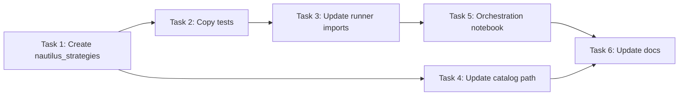

# Extract Strategies & Move Backtest Catalog Implementation Plan

> **For agentic workers:** REQUIRED SUB-SKILL: Use superpowers:subagent-driven-development (recommended) or superpowers:executing-plans to implement this plan task-by-task. Steps use checkbox (`- [ ]`) syntax for tracking.

**Goal:** Extract trading strategies from nautilus_automatron into a separate private `nautilus_strategies` library, update the backtest catalog to be self-contained, and create a Jupyter notebook that orchestrates running strategies against instruments.

**Architecture:** `nautilus_strategies` is a pure strategy library — it contains only strategy classes and their configs, with zero awareness of data sources, catalogs, or file paths. It depends on `nautilus_trader` for base classes (Strategy, Bar, BarType, etc.). `nautilus_automatron` depends on both `nautilus_trader` (for the backtest engine, data loading, serialization) and `nautilus_strategies` (for strategy implementations). All data loading, engine orchestration, and catalog management lives in `nautilus_automatron`. The dependency chain is: `nautilus_trader` ← `nautilus_strategies` ← `nautilus_automatron`.

**Tech Stack:** Python 3.12+, NautilusTrader, hatchling (build), uv (package manager), Jupyter, pyarrow, pandas

---

### Task 1: Create nautilus_strategies package

This is a **pure strategy library**. It contains only strategy classes and config dataclasses. It has no data files, no data loading code, no catalog awareness, and no file I/O. Its only dependency is `nautilus_trader` (for base classes like `Strategy`, `Bar`, `BarType`, indicators, etc.). Data is always provided by the caller (nautilus_automatron).

**Files:**
- Create: `/Users/mordrax/code/nautilus_strategies/pyproject.toml`
- Create: `/Users/mordrax/code/nautilus_strategies/strategies/__init__.py`
- Create: `/Users/mordrax/code/nautilus_strategies/strategies/bbb_strategy.py`
- Create: `/Users/mordrax/code/nautilus_strategies/strategies/ma_trend.py`
- Create: `/Users/mordrax/code/nautilus_strategies/.gitignore`

- [ ] **Step 1: Create project directory and pyproject.toml**

```bash
mkdir -p /Users/mordrax/code/nautilus_strategies/strategies
```

Write `/Users/mordrax/code/nautilus_strategies/pyproject.toml`:

```toml
[project]
name = "nautilus-strategies"
version = "0.1.0"
requires-python = ">=3.12"
dependencies = [
    "nautilus_trader",
]

[project.optional-dependencies]
dev = [
    "pytest>=8.0.0",
]

[tool.hatch.build.targets.wheel]
packages = ["strategies"]

[build-system]
requires = ["hatchling"]
build-backend = "hatchling.build"
```

- [ ] **Step 2: Create .gitignore**

Write `/Users/mordrax/code/nautilus_strategies/.gitignore`:

```
*.pyc
__pycache__/
.venv/
*.egg-info/
.DS_Store
uv.lock
```

- [ ] **Step 3: Copy strategy files**

Copy the strategy source files from nautilus_automatron's runner package. The only change is the import path — `runner.strategies.ma_trend` becomes `strategies.ma_trend`.

Write `/Users/mordrax/code/nautilus_strategies/strategies/ma_trend.py` — exact copy of `/Users/mordrax/code/nautilus_automatron/packages/runner/runner/strategies/ma_trend.py` (no changes needed, it has no internal imports).

Write `/Users/mordrax/code/nautilus_strategies/strategies/bbb_strategy.py` — copy of `/Users/mordrax/code/nautilus_automatron/packages/runner/runner/strategies/bbb_strategy.py` with this import change:

```python
# OLD:
from runner.strategies.ma_trend import (
    TrendDirection,
    calculate_gradients,
    get_trend_direction,
    FAST_LOOKBACK,
    NORMAL_LOOKBACK,
    SLOW_LOOKBACK,
    GRADIENT_THRESHOLD,
)

# NEW:
from strategies.ma_trend import (
    TrendDirection,
    calculate_gradients,
    get_trend_direction,
    FAST_LOOKBACK,
    NORMAL_LOOKBACK,
    SLOW_LOOKBACK,
    GRADIENT_THRESHOLD,
)
```

- [ ] **Step 4: Create __init__.py**

Write `/Users/mordrax/code/nautilus_strategies/strategies/__init__.py`:

```python
from strategies.bbb_strategy import (
    ArrayKind,
    BandKind,
    BBBSignalVariant,
    BBBStrategy,
    BBBStrategyConfig,
    MATrendKind,
)
from strategies.ma_trend import TrendDirection

__all__ = [
    "ArrayKind",
    "BandKind",
    "BBBSignalVariant",
    "BBBStrategy",
    "BBBStrategyConfig",
    "MATrendKind",
    "TrendDirection",
]
```

- [ ] **Step 5: Create venv and install**

```bash
cd /Users/mordrax/code/nautilus_strategies
uv venv
uv pip install -e ".[dev]"
```

- [ ] **Step 6: Commit**

```bash
cd /Users/mordrax/code/nautilus_strategies
git init
git add .
git commit -m "feat: initial nautilus_strategies package with BBB and MA trend strategies"
```

---

### Task 2: Copy tests to nautilus_strategies

**Files:**
- Create: `/Users/mordrax/code/nautilus_strategies/tests/__init__.py`
- Create: `/Users/mordrax/code/nautilus_strategies/tests/test_bbb_strategy.py`
- Create: `/Users/mordrax/code/nautilus_strategies/tests/test_ma_trend.py`

- [ ] **Step 1: Copy test files with updated imports**

```bash
mkdir -p /Users/mordrax/code/nautilus_strategies/tests
touch /Users/mordrax/code/nautilus_strategies/tests/__init__.py
```

Write `/Users/mordrax/code/nautilus_strategies/tests/test_ma_trend.py` — copy of `/Users/mordrax/code/nautilus_automatron/packages/runner/tests/test_ma_trend.py` with this import change:

```python
# OLD:
from runner.strategies.ma_trend import (
    TrendDirection,
    calculate_gradients,
    get_trend_direction,
)

# NEW:
from strategies.ma_trend import (
    TrendDirection,
    calculate_gradients,
    get_trend_direction,
)
```

Write `/Users/mordrax/code/nautilus_strategies/tests/test_bbb_strategy.py` — copy of `/Users/mordrax/code/nautilus_automatron/packages/runner/tests/test_bbb_strategy.py` with these import changes:

```python
# OLD:
from runner.strategies.bbb_strategy import (
    ArrayKind,
    BandKind,
    BBBSignalVariant,
    BBBStrategyConfig,
    MATrendKind,
    is_cross_above,
    is_cross_below,
)
# ...
from runner.strategies.bbb_strategy import BBBStrategy

# NEW:
from strategies.bbb_strategy import (
    ArrayKind,
    BandKind,
    BBBSignalVariant,
    BBBStrategyConfig,
    MATrendKind,
    is_cross_above,
    is_cross_below,
)
# ...
from strategies.bbb_strategy import BBBStrategy
```

- [ ] **Step 2: Run tests to verify everything works**

```bash
cd /Users/mordrax/code/nautilus_strategies
uv run pytest tests/ -v
```

Expected: All 12 tests pass (7 from test_bbb_strategy, 5 from test_ma_trend).

- [ ] **Step 3: Commit**

```bash
cd /Users/mordrax/code/nautilus_strategies
git add tests/
git commit -m "test: add strategy tests from nautilus_automatron"
```

---

### Task 3: Update nautilus_automatron runner to import from nautilus_strategies

**Files:**
- Modify: `/Users/mordrax/code/nautilus_automatron/packages/runner/pyproject.toml`
- Delete: `/Users/mordrax/code/nautilus_automatron/packages/runner/runner/strategies/bbb_strategy.py`
- Delete: `/Users/mordrax/code/nautilus_automatron/packages/runner/runner/strategies/ma_trend.py`
- Delete: `/Users/mordrax/code/nautilus_automatron/packages/runner/runner/strategies/__init__.py`
- Delete: `/Users/mordrax/code/nautilus_automatron/packages/runner/tests/test_bbb_strategy.py`
- Delete: `/Users/mordrax/code/nautilus_automatron/packages/runner/tests/test_ma_trend.py`
- Modify: `/Users/mordrax/code/nautilus_automatron/packages/runner/runner/__init__.py`

- [ ] **Step 1: Add nautilus_strategies as a dependency**

Update `/Users/mordrax/code/nautilus_automatron/packages/runner/pyproject.toml`:

```toml
[project]
name = "nautilus-automatron-runner"
version = "0.1.0"
requires-python = ">=3.12"
dependencies = [
    "nautilus_trader",
    "nautilus_strategies @ file:///Users/mordrax/code/nautilus_strategies",
    "pandas>=2.2.0",
    "pyarrow>=18.0.0",
]

[project.optional-dependencies]
dev = [
    "pytest>=8.0.0",
    "jupyter>=1.0.0",
    "ipykernel>=6.0.0",
]

[tool.hatch.build.targets.wheel]
packages = ["runner"]

[build-system]
requires = ["hatchling"]
build-backend = "hatchling.build"
```

- [ ] **Step 2: Delete strategy source files and tests from nautilus_automatron**

```bash
rm /Users/mordrax/code/nautilus_automatron/packages/runner/runner/strategies/bbb_strategy.py
rm /Users/mordrax/code/nautilus_automatron/packages/runner/runner/strategies/ma_trend.py
rm /Users/mordrax/code/nautilus_automatron/packages/runner/runner/strategies/__init__.py
rmdir /Users/mordrax/code/nautilus_automatron/packages/runner/runner/strategies
rm /Users/mordrax/code/nautilus_automatron/packages/runner/tests/test_bbb_strategy.py
rm /Users/mordrax/code/nautilus_automatron/packages/runner/tests/test_ma_trend.py
```

- [ ] **Step 3: Update runner __init__.py to re-export from nautilus_strategies**

Write `/Users/mordrax/code/nautilus_automatron/packages/runner/runner/__init__.py`:

```python
from strategies import (
    ArrayKind,
    BandKind,
    BBBSignalVariant,
    BBBStrategy,
    BBBStrategyConfig,
    MATrendKind,
    TrendDirection,
)

__all__ = [
    "ArrayKind",
    "BandKind",
    "BBBSignalVariant",
    "BBBStrategy",
    "BBBStrategyConfig",
    "MATrendKind",
    "TrendDirection",
]
```

- [ ] **Step 4: Reinstall runner package with new dependency**

```bash
cd /Users/mordrax/code/nautilus_automatron/packages/runner
uv pip install -e ".[dev]"
```

- [ ] **Step 5: Verify import works**

```bash
cd /Users/mordrax/code/nautilus_automatron/packages/runner
uv run python -c "from strategies import BBBStrategy, BBBStrategyConfig; print('Import OK')"
```

Expected: `Import OK`

- [ ] **Step 6: Commit**

```bash
cd /Users/mordrax/code/nautilus_automatron
git add -A packages/runner/
git commit -m "refactor: remove strategies, import from nautilus_strategies"
```

---

### Task 4: Update backtest catalog path to local

**Files:**
- Modify: `/Users/mordrax/code/nautilus_automatron/.env`
- Modify: `/Users/mordrax/code/nautilus_automatron/.env.example`

- [ ] **Step 1: Update .env to use local catalog path**

Edit `/Users/mordrax/code/nautilus_automatron/.env`:

```
NAUTILUS_PORT=8000
NAUTILUS_STORE_PATH=./backtest_catalog
VITE_PORT=5173
VITE_API_URL=http://localhost:8000
```

- [ ] **Step 2: Update .env.example**

Edit `/Users/mordrax/code/nautilus_automatron/.env.example`:

```
# Per-worktree configuration — copy to .env and customize
# Ports are assigned sequentially: main=8000/5173, wt1=8001/5174, etc.

# Backend
NAUTILUS_PORT=8000
NAUTILUS_STORE_PATH=./backtest_catalog

# Frontend
VITE_PORT=5173
VITE_API_URL=http://localhost:8000
```

- [ ] **Step 3: Verify server starts with local catalog**

```bash
cd /Users/mordrax/code/nautilus_automatron
NAUTILUS_STORE_PATH=./backtest_catalog uvicorn server.main:app --app-dir packages/server --port 8000 &
sleep 2
curl -s http://localhost:8000/api/runs | python -m json.tool | head -20
kill %1
```

Expected: JSON response listing the 5 XAUUSD runs from the local catalog.

- [ ] **Step 4: Commit**

```bash
cd /Users/mordrax/code/nautilus_automatron
git add .env.example
git commit -m "chore: update store path to local backtest_catalog"
```

Note: `.env` is gitignored, so only `.env.example` is committed.

---

### Task 5: Create orchestration Jupyter notebook

**Files:**
- Create: `/Users/mordrax/code/nautilus_automatron/packages/runner/runner/run_backtest.ipynb`
- Delete: `/Users/mordrax/code/nautilus_automatron/packages/runner/runner/bbb_backtest.ipynb`

This notebook replaces the old `bbb_backtest.ipynb` with a more general orchestration notebook. It owns all data loading and engine setup — strategies receive data via the NautilusTrader engine (which calls `strategy.on_bar()` with Bar objects). The notebook demonstrates running BBBStrategy against XAUUSD as a working example. The data flow is: notebook loads feather data from catalog → creates NautilusTrader Bar objects → feeds them to the engine → engine calls strategy methods with Bar/instrument data.

- [ ] **Step 1: Delete old notebook**

```bash
rm /Users/mordrax/code/nautilus_automatron/packages/runner/runner/bbb_backtest.ipynb
```

- [ ] **Step 2: Create the orchestration notebook**

Write `/Users/mordrax/code/nautilus_automatron/packages/runner/runner/run_backtest.ipynb` as a Jupyter notebook with the following cells:

**Cell 1 (markdown):**
```markdown
# Backtest Runner

Orchestrates running strategies against instruments using NautilusTrader's BacktestEngine.
Results are written to `backtest_catalog/` as feather files for the dashboard.

## Available Strategies
- **BBBStrategy** — Bollinger Band Breakout with optional MA trend filtering

## Available Instruments
- **XAUUSD** — Gold vs US Dollar (CFD, 1-min bars from IB)
```

**Cell 2 (code) — Imports:**
```python
import os
from decimal import Decimal
from pathlib import Path
from dataclasses import dataclass

import pandas as pd
import pyarrow.ipc as ipc

from nautilus_trader.backtest.config import BacktestEngineConfig
from nautilus_trader.backtest.engine import BacktestEngine
from nautilus_trader.config import LoggingConfig
from nautilus_trader.model.currencies import USD
from nautilus_trader.model.data import Bar, BarType
from nautilus_trader.model.enums import AccountType, OmsType
from nautilus_trader.model.identifiers import InstrumentId, Symbol, TraderId, Venue
from nautilus_trader.model.instruments import CurrencyPair
from nautilus_trader.model.objects import Currency, Money, Price, Quantity
from nautilus_trader.persistence.config import StreamingConfig
from nautilus_trader.serialization.arrow.serializer import ArrowSerializer

from strategies import (
    ArrayKind,
    BandKind,
    BBBSignalVariant,
    BBBStrategy,
    BBBStrategyConfig,
    MATrendKind,
)
```

**Cell 3 (markdown):**
```markdown
## Instrument Definitions
```

**Cell 4 (code) — Instrument registry:**
```python
SIM = Venue("SIM")

XAUUSD_SIM = CurrencyPair(
    instrument_id=InstrumentId(Symbol("XAU/USD"), SIM),
    raw_symbol=Symbol("XAU/USD"),
    base_currency=Currency.from_str("XAU"),
    quote_currency=Currency.from_str("USD"),
    price_precision=2,
    size_precision=0,
    price_increment=Price.from_str("0.01"),
    size_increment=Quantity.from_int(1),
    lot_size=None,
    max_quantity=None,
    min_quantity=Quantity.from_int(1),
    max_price=None,
    min_price=None,
    margin_init=Decimal("0.03"),
    margin_maint=Decimal("0.03"),
    maker_fee=Decimal("0.00002"),
    taker_fee=Decimal("0.00002"),
    ts_event=0,
    ts_init=0,
)

# Registry of available instruments
INSTRUMENTS = {
    "XAUUSD": XAUUSD_SIM,
}
```

**Cell 5 (markdown):**
```markdown
## Load Bar Data from Catalog

Reads existing bar data from a previous backtest run in the catalog.
This avoids needing an external CSV — the catalog already contains XAUUSD bar data.
```

**Cell 6 (code) — Load bars from catalog:**
```python
CATALOG_PATH = Path(os.environ.get(
    "NAUTILUS_STORE_PATH",
    str(Path(__file__).resolve().parents[3] / "backtest_catalog"),
))

def find_bar_data(catalog_path: Path, instrument_prefix: str) -> tuple[Path, BarType] | None:
    """Find the first run containing bar data for the given instrument."""
    backtest_dir = catalog_path / "backtest"
    if not backtest_dir.exists():
        return None

    for run_dir in sorted(backtest_dir.iterdir()):
        bar_dir = run_dir / "bar"
        if not bar_dir.exists():
            continue
        for bar_type_dir in bar_dir.iterdir():
            if instrument_prefix in bar_type_dir.name:
                feather_files = list(bar_type_dir.glob("*.feather"))
                if feather_files:
                    bar_type = BarType.from_str(bar_type_dir.name)
                    return feather_files[0], bar_type
    return None

def load_bars_from_catalog(feather_path: Path, bar_type: BarType) -> list[Bar]:
    """Load Bar objects from a feather file using NautilusTrader's ArrowSerializer."""
    with open(feather_path, "rb") as f:
        reader = ipc.open_stream(f)
        table = reader.read_all()
    return ArrowSerializer.deserialize(Bar, table)

result = find_bar_data(CATALOG_PATH, "XAUUSD")
if result is None:
    raise FileNotFoundError(f"No XAUUSD bar data found in {CATALOG_PATH}")

feather_path, bar_type = result
bars = load_bars_from_catalog(feather_path, bar_type)
print(f"Loaded {len(bars)} bars of type {bar_type}")
print(f"From: {bars[0].ts_init} to {bars[-1].ts_init}")
```

**Cell 7 (markdown):**
```markdown
## Configure and Run Backtest

Set up the strategy config and run the backtest engine.
Results are streamed to the catalog for the dashboard to pick up.
```

**Cell 8 (code) — Run backtest:**
```python
instrument = INSTRUMENTS["XAUUSD"]

strategy_config = BBBStrategyConfig(
    instrument_id=instrument.id,
    bar_type=bar_type,
    trade_size=Decimal("1"),
    buy_array_kind=ArrayKind.CLOSE,
    buy_band_kind=BandKind.TOP,
    buy_period=20,
    buy_sd=1.0,
    sell_array_kind=ArrayKind.CLOSE,
    sell_band_kind=BandKind.TOP,
    sell_period=20,
    sell_sd=3.0,
    frequency_bars=10,
    signal_variant=BBBSignalVariant.BASELINE,
)

engine_config = BacktestEngineConfig(
    trader_id=TraderId("BACKTESTER-001"),
    logging=LoggingConfig(log_level="INFO"),
    streaming=StreamingConfig(
        catalog_path=str(CATALOG_PATH),
        replace_existing=True,
    ),
)

engine = BacktestEngine(config=engine_config)

engine.add_venue(
    venue=SIM,
    oms_type=OmsType.NETTING,
    account_type=AccountType.MARGIN,
    base_currency=USD,
    starting_balances=[Money(100_000, USD)],
)

engine.add_instrument(instrument)
engine.add_data(bars)
engine.add_strategy(strategy=BBBStrategy(config=strategy_config))

print("Running backtest...")
engine.run()
print("Backtest complete!")
```

**Cell 9 (markdown):**
```markdown
## Results Summary
```

**Cell 10 (code) — Display results:**
```python
with pd.option_context(
    "display.max_rows", 100,
    "display.max_columns", None,
    "display.width", 300,
):
    print("=== Account Report ===")
    print(engine.trader.generate_account_report(SIM))
    print("\n=== Positions Report ===")
    print(engine.trader.generate_positions_report())
    print("\n=== Order Fills Report ===")
    print(engine.trader.generate_order_fills_report())
```

**Cell 11 (code) — Cleanup:**
```python
engine.reset()
engine.dispose()
print(f"Results written to {CATALOG_PATH}")
print("Run the dashboard (bun run dev) to view results.")
```

- [ ] **Step 3: Commit**

```bash
cd /Users/mordrax/code/nautilus_automatron
git add packages/runner/runner/run_backtest.ipynb
git rm packages/runner/runner/bbb_backtest.ipynb
git commit -m "feat: replace bbb_backtest with general orchestration notebook"
```

---

### Task 6: Update documentation

**Files:**
- Modify: `/Users/mordrax/code/nautilus_automatron/CLAUDE.md`

- [ ] **Step 1: Update CLAUDE.md with catalog and strategy info**

Add the following section to `/Users/mordrax/code/nautilus_automatron/CLAUDE.md` after the existing content:

```markdown

## Backtest Catalog
- Located at `./backtest_catalog/` (gitignored, contains ~95MB of feather data)
- Configured via `NAUTILUS_STORE_PATH` env var (defaults to `./backtest_catalog`)
- Contains NautilusTrader StreamingConfig output: UUID-named run dirs with config.json + feather files
- E2e test data is separate at `packages/client/e2e/test-data/`

## Strategies
- Trading strategies live in a separate private package: `nautilus_strategies` at `/Users/mordrax/code/nautilus_strategies`
- `nautilus_strategies` is a pure library — strategies only, no data, no I/O. Depends on `nautilus_trader` for base classes.
- Dependency chain: `nautilus_trader` ← `nautilus_strategies` ← `nautilus_automatron`
- nautilus_automatron imports strategies and handles all data loading and engine orchestration
- The runner package (`packages/runner`) orchestrates backtests via Jupyter notebooks
- To run a backtest: open `packages/runner/runner/run_backtest.ipynb`
```

- [ ] **Step 2: Commit**

```bash
cd /Users/mordrax/code/nautilus_automatron
git add CLAUDE.md
git commit -m "docs: add catalog location and strategy library docs"
```

---

## Task Dependency Graph



- Tasks 1 → 2 → 3 are sequential (each depends on the prior)
- Task 4 is independent of Tasks 1-3 (can run in parallel)
- Task 5 depends on Task 3 (needs strategies imported)
- Task 6 depends on Tasks 4 and 5 (documents the final state)
