# Implementation Plan — Key Levels Event-Based Model Slice

**Spec:** `docs/superpowers/specs/2026-05-02-key-levels-event-model-slice-design.md`
**Trello:** [#118](https://trello.com/c/x87rBYcx)
**Branch:** `feature/key-levels-event-model-slice`

## Strategy

Subagent-driven execution. Three parallel-friendly task groups: **Indicators**, **Server**, **Frontend**. Indicators must complete before Server. Frontend can start after the API contract is locked (Pydantic DTO defined).

## Task 1 — Update KeyLevel data model

**File:** `packages/indicators/indicators/key_levels/model.py`

Replace the `KeyLevel` dataclass with the new shape:

```python
@dataclass(frozen=True)
class KeyLevel:
    price: float
    strength: float
    start_ts: int
    end_ts: int | None
    source: Source
    bounce_count: int
    zone_upper: float | None
    zone_lower: float | None
    meta: SourceMeta
```

Update `EqualHighsLowsMeta` to add `touch_count: int`.

Leave other meta types unchanged for now (they're only consumed by detectors that won't compile until their migration cards land — that's accepted per the spec).

**Verify:** `from indicators.key_levels.model import KeyLevel` imports cleanly. Other metas remain importable.

## Task 2 — Rewrite EqualHighsLowsDetector

**File:** `packages/indicators/indicators/key_levels/detectors/equal_highs_lows.py`

Implement `_TrackedLevel` dataclass and the lifecycle-tracking detector per the spec design section. Public surface stays the same: `name`, `warmup_bars`, `update(bar)`, `levels() -> list[KeyLevel]`, `reset()`.

Key implementation notes:

- `_pending_swings: dict[Literal["high", "low"], list[tuple[float, int]]]` — buffer for swings that haven't yet formed a cluster.
- `_bar_interval_ns: int | None` — detected from first two bars' `ts_event` diff; used for aged-out check. Default to a 1-bar tolerance if unknown.
- `_next_id: int` for stable level IDs.
- Centroid recompute: `centroid = sum(members) / len(members)` after each new member.
- Strength is computed inside `levels()`, not stored.

## Task 3 — Update KeyLevelIndicator + tests

**Files:**

- `packages/indicators/indicators/key_levels/indicator.py`
- `packages/indicators/tests/test_equal_highs_lows.py`
- `packages/indicators/tests/test_indicator.py`
- `packages/indicators/tests/test_model.py`

`KeyLevelIndicator.levels` must return the new shape. Confirm scalar summary properties (`nearest_support`, etc.) still work — they are price-based proximity calculations, not lifecycle-aware, so they should compute against active levels (those with `end_ts is None`).

Test updates:

- `test_model.py`: instantiate `KeyLevel` with new fields; verify frozen.
- `test_equal_highs_lows.py`:
  - Rewrite to verify lifecycle: a level born at bar N with `start_ts == bar_N.ts_event`, ends at bar M with `end_ts == bar_M.ts_event` after a break.
  - Verify aged-out path: long stretch of non-touching bars expires the level.
  - Verify bar-level `touch_count` increments separately from `bounce_count`.
  - Verify strength decay shape: 2 touches → ~1.0, 5 touches → ~0.37, 10 touches → ~0.05 (within tolerance).
- `test_indicator.py`: `KeyLevelIndicator.levels` returns new shape; scalar summary properties consider only active levels.

## Task 4 — Disable broken detectors at registry / import level

**Files:**

- `packages/indicators/indicators/key_levels/__init__.py`
- `packages/indicators/indicators/key_levels/detectors/__init__.py`

Other detectors on main (`wick_rejection`, `atr_volatility`, `fibonacci`, `pivot_points`, `psychological`) construct `KeyLevel` with the old shape. They will fail to instantiate after Task 1.

Options:
1. Quick-fix each one to import-clean: stub their `levels()` to return `[]` until migrated.
2. Skip importing them at the package level; drop their tests.

**Choice: option 1.** Add a one-line stub to each detector's `update`/`levels` methods so they import cleanly but produce no levels. Mark each with a `# TODO(card #NNN): migrate to event-based KeyLevel` comment. Their tests are skipped via `pytest.mark.skip(reason="awaiting migration card #NNN")`.

This keeps the package importable, the server bootable, and ensures the slice doesn't accidentally regress unrelated functionality.

## Task 5 — Server endpoint

**Files:**

- `packages/server/server/store/key_levels.py` (new)
- `packages/server/server/routes/key_levels.py` (new)
- `packages/server/server/main.py` (add router include)
- `packages/server/tests/test_key_levels_route.py` (new)

Implement `KeyLevelDto`, `EqualHighsLowsMetaDto`, discriminated `SourceMetaDto`, registry, `compute_key_levels`, and the two routes per spec.

Tests: hit `/api/bars/{bar_type}/key-levels?detectors=equal_highs_lows` against a small synthetic bar series; verify response shape, ISO timestamps, error on unknown detector, 404 on unknown bar_type. Hit `/api/key-levels/detectors` and verify response shape.

## Task 6 — Frontend types + API client + hook

**Files:**

- `packages/client/src/types/key-levels.ts` (new)
- `packages/client/src/lib/key-levels-api.ts` (new)
- `packages/client/src/hooks/use-key-levels.ts` (new)

`types/key-levels.ts`:

```ts
export type EqualHighsLowsMetaDto = {
  readonly kind: 'equal_highs_lows'
  readonly touch_prices: readonly number[]
  readonly side: 'high' | 'low'
  readonly touch_count: number
}

export type SourceMetaDto = EqualHighsLowsMetaDto  // widens with detectors

export type KeyLevelDto = {
  readonly price: number
  readonly strength: number
  readonly start_ts: string
  readonly end_ts: string | null
  readonly source: 'equal_highs_lows'
  readonly bounce_count: number
  readonly zone_upper: number | null
  readonly zone_lower: number | null
  readonly meta: SourceMetaDto
}

export type DetectorMeta = {
  readonly id: string
  readonly label: string
  readonly color: string
}
```

`lib/key-levels-api.ts`:

```ts
import { fetchJson } from './api'
import type { KeyLevelDto, DetectorMeta } from '@/types/key-levels'

export const getKeyLevels = (barType: string, detectors: readonly string[]) =>
  fetchJson<readonly KeyLevelDto[]>(
    `/api/bars/${encodeURIComponent(barType)}/key-levels?detectors=${detectors.join(',')}`
  )

export const getDetectors = () =>
  fetchJson<readonly DetectorMeta[]>('/api/key-levels/detectors')
```

`hooks/use-key-levels.ts`:

```ts
import { useQuery } from '@tanstack/react-query'
import { Effect } from 'effect'
import * as api from '@/lib/key-levels-api'

export const useKeyLevels = (barType: string, detectors: readonly string[]) =>
  useQuery({
    queryKey: ['key-levels', barType, [...detectors].sort().join(',')],
    queryFn: () => Effect.runPromise(api.getKeyLevels(barType, detectors)),
    enabled: detectors.length > 0,
  })

export const useDetectors = () =>
  useQuery({
    queryKey: ['key-levels-detectors'],
    queryFn: () => Effect.runPromise(api.getDetectors()),
  })
```

## Task 7 — Frontend renderer

**File:** `packages/client/src/lib/key-level-render.ts` (new)

Implement `buildKeyLevelSeries(levels, datetimeLabels)` per spec. Includes `snapToCategory(ts: string, labels: readonly string[])` using binary search on ISO strings (lexicographic = chronological for ISO 8601 with consistent timezone). Source-keyed style map for color/baseWidth.

Unit test: `packages/client/src/lib/key-level-render.test.ts` (Vitest if available; else add `.spec.ts` near the file). Verify:
- empty levels → empty series
- one active level → 2-coord segment from start_ts label to last label
- one finalized level → 2-coord segment between exact labels
- ts before first / after last label → snap to first / last
- opacity / width scale with strength

## Task 8 — CandlestickChart integration

**File:** `packages/client/src/components/chart/CandlestickChart.tsx`

Add optional prop `keyLevels?: readonly KeyLevelDto[]`. In `buildOption`, call `buildKeyLevelSeries(keyLevels ?? [], ohlc.datetime)` and append the resulting series to the `series` array (after candlestick + overlay, before panel series).

Do not modify the existing trade markLine plumbing.

## Task 9 — Toggle UI + page integration

**Files:**

- `packages/client/src/components/chart/KeyLevelsPanel.tsx` (new)
- The page component(s) currently consuming `<CandlestickChart />` — search for usages and add the toggle.

`KeyLevelsPanel`:

- Calls `useDetectors()` to get the available list.
- Renders one checkbox per detector with the source-mapped color as the box color.
- Manages a controlled `selectedDetectors` set via props (parent owns state).

Parent page:

- Adds `selectedDetectors` state (default empty).
- Calls `useKeyLevels(barType, selectedDetectors)`.
- Passes `keyLevels={data}` to `<CandlestickChart />`.
- Renders `<KeyLevelsPanel selectedDetectors={...} onChange={...} />` adjacent to existing indicator picker.

## Task 10 — Lint + typecheck

```bash
# Python
cd packages/indicators && .venv/bin/python -m pytest tests/ -v
cd packages/server   && .venv/bin/python -m pytest tests/ -v

# TypeScript
cd packages/client && bunx tsc --noEmit

# ESLint
cd packages/client && bun run lint
```

All pass before moving to Task 11.

## Task 11 — Playwright e2e tests

**File:** `packages/client/e2e/key-levels.spec.ts` (new)

Tests:

1. **Toggle visibility**: navigate to a chart with bars, find the KeyLevels panel, check the `Equal Highs/Lows` checkbox. Verify a `Key Levels` series exists in the eCharts instance (`window.__ECHARTS_INSTANCE__`). Uncheck → series gone or empty.
2. **Levels render with correct prices**: with the toggle on, fetch the eCharts option and verify markLine data has at least one entry whose `coord[0][1]` (price) matches a known level for the test data.
3. **Opacity scales with strength**: verify lineStyle.opacity differs across levels (proxy for strength variation).
4. **No regressions**: existing chart-analysis tests still pass.

Run via:
```bash
TEST_VITE_PORT=5180 TEST_API_PORT=8010 \
  cd packages/client && \
  bunx playwright test key-levels.spec.ts --project=headless
```

## Sequencing

```mermaid
flowchart LR
  T1[1. KeyLevel model] --> T2[2. EHL detector] --> T3[3. Indicator + tests]
  T3 --> T4[4. Stub broken detectors] --> T5[5. Server endpoint]
  T5 --> T6[6. FE types + hook]
  T6 --> T7[7. Renderer]
  T7 --> T8[8. Chart integration]
  T8 --> T9[9. Toggle UI + page]
  T9 --> T10[10. Lint + typecheck]
  T10 --> T11[11. Playwright]
```



Tasks 1–4 (indicators package) → Task 5 (server) → Tasks 6–9 (frontend) → 10 → 11.

## Subagent dispatch

Implementer subagents per `superpowers:subagent-driven-development`:

- **Subagent A**: Tasks 1–4 (indicators package).
- **Subagent B**: Task 5 (server) — depends on A.
- **Subagent C**: Tasks 6–9 (frontend) — depends on B (only for shape compatibility, can read API contract from Task 5 spec).

Tasks 10–11 run in the foreground after C completes.

## Definition of done for the slice

- All 11 tasks complete.
- All tests pass (Python + TypeScript + Playwright headless).
- Card #118 ready to move to Review after browser validation.
