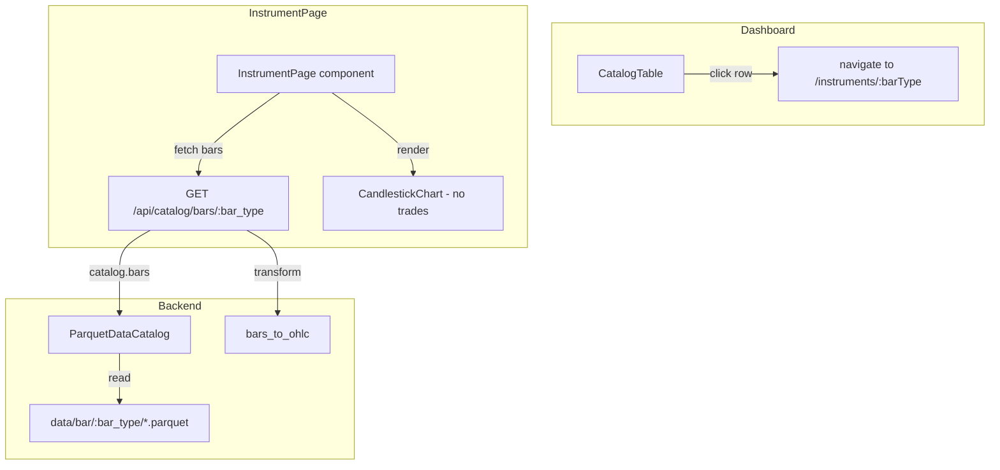

# Instrument Chart Page

**Trello:** Card #106 (UI label)
**Related:** Card #105 — Separate indicators from runs (dependency for indicator panels)

## Overview

Add a dedicated page for viewing raw instrument bar data as a candlestick chart, reachable by clicking an instrument in the dashboard catalog table. Uses the same `CandlestickChart` component as the run detail page, with trades made optional.

## Architecture



## Backend

### New endpoint: `GET /api/catalog/bars/{bar_type}`

Returns OHLC data for a raw catalog instrument bar type.

- Uses `catalog.bars(bar_types=[bar_type])` to read from `data/bar/`
- Transforms via existing `bars_to_ohlc(bars)` → returns `OhlcData`
- Response format identical to `GET /api/runs/{run_id}/bars/{bar_type}`

### Update `list_catalog_entries()`

Currently scans `backtest/{run_id}/bar/` directories manually with PyArrow. Should be updated to scan `data/bar/` via `ParquetDataCatalog` since the catalog instruments live in the `data/` directory, not in backtest runs.

- Use `catalog.bars(bar_types=[bar_type])` or direct parquet reads from `data/bar/`
- Extract instrument_id, bar_count, ts_min, ts_max from the bar data
- Return the same `CatalogEntry` structure

## Frontend

### Route: `/instruments/:barType`

New page component: `InstrumentPage`

- URL-encodes the bar type in the route param (e.g., `XAUUSD.IBCFD-1-MINUTE-MID-EXTERNAL`)
- Fetches bars via new API endpoint
- Renders `CandlestickChart` without trades
- Indicator panels will be added once card #105 (Separate indicators from runs) is complete

### CatalogTable click handler

Add row click to `CatalogTable` that navigates to `/instruments/{barType}` where `barType` is constructed from the catalog entry (e.g., `{instrument}-{timeframe}`).

### CandlestickChart — make trades optional

Current props:
```typescript
type CandlestickChartProps = {
  readonly ohlc: OhlcData
  readonly trades: readonly Trade[]
  readonly indicators?: readonly IndicatorResult[]
  readonly currentTradeIndex: number
  readonly onSelectTrade: (index: number) => void
  readonly onChartReady?: (chart: echarts.ECharts) => void
}
```

Updated props:
```typescript
type CandlestickChartProps = {
  readonly ohlc: OhlcData
  readonly trades?: readonly Trade[]
  readonly indicators?: readonly IndicatorResult[]
  readonly currentTradeIndex?: number
  readonly onSelectTrade?: (index: number) => void
  readonly onChartReady?: (chart: echarts.ECharts) => void
}
```

Changes:
- `buildOption()`: pass `trades ?? []` — empty array means no mark lines
- Click handler: only bind when `trades` provided
- `TradeTooltip`: only render when `trades` and `currentTradeIndex` provided
- Run detail page: no changes needed — passes trades as before

### New API client function

```typescript
export const getCatalogBars = (barType: string) =>
  fetchJson<OhlcData>(`/api/catalog/bars/${encodeURIComponent(barType)}`)
```

### New hook

```typescript
export const useCatalogBars = (barType: string) =>
  useQuery({
    queryKey: ['catalog-bars', barType],
    queryFn: () => api.runEffect(api.getCatalogBars(barType)),
    enabled: !!barType,
  })
```

## Dependencies

- **Card #105 — Separate indicators from runs:** Indicator panels on the instrument page are blocked until indicators are decoupled from run IDs. The chart page will ship without indicators initially and gain them once #105 is complete.

## Out of scope

- Indicator panels (card #105)
- Trade overlays on instrument chart
- Date range filtering on the endpoint
