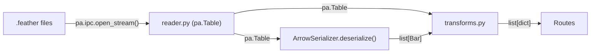
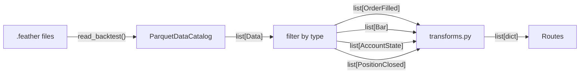

# Migrate Server to Use ParquetDataCatalog for Data Access

## Overview

Replace the custom `reader.py` file-reading functions with NautilusTrader's `ParquetDataCatalog` for accessing backtest results. The server currently reimplements catalog functionality by manually reading feather files — this should use the library's built-in catalog instead.

**Related Trello card:** [#101 - Migrate server to use ParquetDataCatalog](https://trello.com/c/i7xXYSvA)
**Parallel work:** Card #99 (Backtest CRUD) modifies some of the same files. See conflict resolution guidance below.

## Goals

1. Replace `read_fills()`, `read_positions_opened()`, `read_positions_closed()`, `read_account_states()` with `ParquetDataCatalog.read_backtest()`
2. Replace manual `ArrowSerializer.deserialize()` in `bars.py` and `indicators.py` with catalog-provided deserialization
3. Replace `list_bar_types()` with catalog-based discovery from `read_backtest()` results
4. Replace `list_run_ids()` with `catalog.list_backtest_runs()`
5. Update transform functions to work with deserialized NautilusTrader objects instead of Arrow tables
6. Create a `_catalog()` FastAPI dependency for clean catalog access
7. All existing API responses remain identical (no breaking changes)
8. All Playwright e2e tests pass unchanged

**Out of scope:** Cloud storage support, Rust backend, time-range filtering.

## Architecture

### Current Data Flow



### New Data Flow



### How NautilusTrader Persists Backtest Data

The `StreamingFeatherWriter` (configured via `StreamingConfig` on `BacktestEngineConfig`) subscribes to all message bus events and writes them as feather files:

```
{catalog_path}/backtest/{instance_id}/
  config.json                           # Full BacktestEngineConfig
  order_filled_{ts}.feather             # Flat file (events)
  position_opened_{ts}.feather          # Flat file
  position_closed_{ts}.feather          # Flat file
  account_state_{ts}.feather            # Flat file
  bar/                                  # Per-instrument subdirectory
    {bar_type}/
      {bar_type}_{ts}.feather
```

`catalog.read_backtest(instance_id)` reads all feather files, deserializes via `ArrowSerializer`, and returns a sorted `list[Data]` containing all types mixed together.

**Prerequisite:** Card #99 must configure the backtest runner with `StreamingConfig` so event data gets written. Currently only Bar data exists in the catalog.

## Design

### 1. Data Access Layer

**New file: `store/catalog_reader.py`**

Typed filter functions over `read_backtest()` results:

```python
from nautilus_trader.persistence.catalog.parquet import ParquetDataCatalog
from nautilus_trader.model.events.order import OrderFilled
from nautilus_trader.model.events.account import AccountState
from nautilus_trader.model.events.position import PositionOpened, PositionClosed
from nautilus_trader.model.data import Bar


def read_backtest_data(catalog: ParquetDataCatalog, run_id: str) -> list:
    return catalog.read_backtest(run_id)


def get_fills(data: list) -> list[OrderFilled]:
    return [d for d in data if isinstance(d, OrderFilled)]


def get_positions_closed(data: list) -> list[PositionClosed]:
    return [d for d in data if isinstance(d, PositionClosed)]


def get_positions_opened(data: list) -> list[PositionOpened]:
    return [d for d in data if isinstance(d, PositionOpened)]


def get_account_states(data: list) -> list[AccountState]:
    return [d for d in data if isinstance(d, AccountState)]


def get_bars(data: list, bar_type: str | None = None) -> list[Bar]:
    bars = [d for d in data if isinstance(d, Bar)]
    if bar_type:
        bars = [b for b in bars if str(b.bar_type) == bar_type]
    return bars


def list_bar_types_from_data(data: list) -> list[str]:
    return sorted({str(b.bar_type) for b in data if isinstance(b, Bar)})
```

**New FastAPI dependency:**

```python
def _catalog() -> ParquetDataCatalog:
    return ParquetDataCatalog(str(Path(get_settings().store_path)))
```

**What stays in `reader.py`:**

| Function | Why |
|----------|-----|
| `read_run_config()` | JSON config — catalog doesn't handle this |
| `delete_run()` | Added by card #99 — `shutil.rmtree`, no catalog equivalent |
| `list_catalog_entries()` | Cross-run metadata scanning — business logic |

**What gets removed from `reader.py`:**

- `read_fills()` — replaced by `get_fills(read_backtest_data(...))`
- `read_positions_opened()` — replaced by `get_positions_opened(...)`
- `read_positions_closed()` — replaced by `get_positions_closed(...)`
- `read_account_states()` — replaced by `get_account_states(...)`
- `read_bars_raw()` — replaced by `get_bars(...)`
- `list_bar_types()` — replaced by `list_bar_types_from_data(...)`
- `list_run_ids()` — replaced by `catalog.list_backtest_runs()`

**What gets updated in `reader.py`:**

- `_read_ipc_stream()` — stays as internal helper, used only by `list_catalog_entries()`
- `list_catalog_entries()` — update to accept `catalog: ParquetDataCatalog` and use `catalog.list_backtest_runs()` instead of `list_run_ids()`. Keeps using `_read_ipc_stream()` for efficient Arrow metadata extraction (reading all backtest data via `read_backtest()` just for bar metadata would be wasteful).

### 2. Transform Updates

Transforms change from accepting `pa.Table` to accepting deserialized NautilusTrader objects. All output formats (JSON dicts) remain identical.

**`fills_table_to_dicts(table: pa.Table)` -> `fills_to_dicts(fills: list[OrderFilled])`**

Read attributes from `OrderFilled` objects instead of Arrow table columns:

| Arrow column | Object attribute | Type |
|-------------|-----------------|------|
| `client_order_id` | `f.client_order_id` | `ClientOrderId` |
| `venue_order_id` | `f.venue_order_id` | `VenueOrderId` |
| `trade_id` | `f.trade_id` | `TradeId` |
| `position_id` | `f.position_id` | `PositionId \| None` |
| `instrument_id` | `f.instrument_id` | `InstrumentId` |
| `order_side` | `f.order_side` | `OrderSide` |
| `order_type` | `f.order_type` | `OrderType` |
| `last_qty` | `f.last_qty` | `Quantity` |
| `last_px` | `f.last_px` | `Price` |
| `currency` | `f.currency` | `Currency` |
| `commission` | `f.commission` | `Money` |
| `ts_event` | `f.ts_event` | `int` (nanoseconds) |

All Nautilus types convert to strings via `str()`. Numeric types (`Quantity`, `Price`) convert via `float()`.

**`positions_closed_to_dicts(table: pa.Table)` -> `positions_closed_to_dicts(positions: list[PositionClosed])`**

| Arrow column | Object attribute | Type |
|-------------|-----------------|------|
| `position_id` | `p.position_id` | `PositionId` |
| `instrument_id` | `p.instrument_id` | `InstrumentId` |
| `strategy_id` | `p.strategy_id` | `StrategyId` |
| `entry` | `p.entry` | `OrderSide` |
| `side` | `p.side` | `PositionSide` |
| `quantity` | `p.quantity` | `Quantity` |
| `peak_qty` | `p.peak_qty` | `Quantity` |
| `avg_px_open` | `p.avg_px_open` | `float` |
| `avg_px_close` | `p.avg_px_close` | `float` |
| `realized_return` | `p.realized_return` | `float` |
| `realized_pnl` | `p.realized_pnl` | `Money` |
| `currency` | `p.currency` | `Currency` |
| `ts_opened` | `p.ts_opened` | `int` (nanoseconds) |
| `ts_closed` | `p.ts_closed` | `int` (nanoseconds) |
| `duration_ns` | `p.duration_ns` | `int` |

**`account_states_to_dicts(table: pa.Table)` -> `account_states_to_dicts(states: list[AccountState])`**

`AccountState` has `balances: list[AccountBalance]` instead of flat columns. Each `AccountBalance` has:
- `b.total` -> `Money`
- `b.free` -> `Money`
- `b.locked` -> `Money`
- `b.currency` -> `Currency`

Extract balance from `states[i].balances[0]` (first balance entry).

**`bars_to_ohlc(bars: list[Bar])` -> NO CHANGE**

Already accepts `list[Bar]` objects. Attributes confirmed: `bar.open`, `bar.high`, `bar.low`, `bar.close`, `bar.volume`, `bar.ts_event`.

**`run_summary(...)` -> signature update**

Changes from `pa.Table | None` params to `list[OrderFilled]`, `list[PositionClosed]`, `list[PositionOpened]`. Uses `len()` for counts instead of `table.num_rows`.

**`_extract_strategy_name(config, positions_opened)` -> update**

Changes from reading Arrow table column to `str(positions[0].strategy_id)`.

**Unchanged transforms:**
- `fills_to_trades()` — takes `list[dict]` (output of `fills_to_dicts`)
- `account_states_to_equity()` — takes `list[dict]`
- `catalog_entry_to_dict()` — takes plain dict
- `_ns_to_iso()`, `_safe_float()`, `_parse_timeframe()` — utility helpers

### 3. Route Updates

Each route changes from `reader.function(store_path, run_id)` to catalog-based access.

| Route | Before | After |
|-------|--------|-------|
| `runs.py: list_runs` | `reader.list_run_ids(store_path)` + per-run `reader.read_fills/positions` | `catalog.list_backtest_runs()` + per-run `read_backtest_data(catalog, run_id)` + filter by type |
| `runs.py: get_run` | `reader.read_run_config()` + `reader.read_fills()` + `reader.read_positions_closed()` + `reader.list_bar_types()` | `reader.read_run_config()` + `read_backtest_data()` + filter |
| `fills.py: get_fills` | `reader.read_fills()` -> `fills_table_to_dicts(table)` | `read_backtest_data()` -> `get_fills()` -> `fills_to_dicts()` |
| `fills.py: get_trades` | Same as fills -> `fills_to_trades()` | Same pattern |
| `positions.py` | `reader.read_positions_closed()` -> `positions_closed_to_dicts(table)` | `read_backtest_data()` -> `get_positions_closed()` -> `positions_closed_to_dicts()` |
| `account.py: get_account` | `reader.read_account_states()` -> `account_states_to_dicts(table)` | `read_backtest_data()` -> `get_account_states()` -> `account_states_to_dicts()` |
| `account.py: get_equity` | Same -> `account_states_to_equity()` | Same pattern |
| `bars.py: list_bar_types` | `reader.list_bar_types()` | `read_backtest_data()` -> `list_bar_types_from_data()` |
| `bars.py: get_bars` | `reader.read_bars_raw()` -> `ArrowSerializer.deserialize(Bar, table)` -> `bars_to_ohlc(bars)` | `read_backtest_data()` -> `get_bars(data, bar_type)` -> `bars_to_ohlc(bars)` |
| `indicators.py` | `reader.read_bars_raw()` -> `ArrowSerializer.deserialize()` -> `compute_indicator()` | `read_backtest_data()` -> `get_bars(data, bar_type)` -> `compute_indicator()` |
| `catalog.py` | `reader.list_catalog_entries()` -> `catalog_entry_to_dict()` | **No change** |

**Dependency injection:** Routes that need both `read_run_config()` and catalog data (e.g., `runs.py`) inject both `_store_path()` and `_catalog()`. Routes that only use catalog data drop `_store_path()`.

### 4. What Stays Custom

| Function | Location | Why |
|----------|----------|-----|
| `read_run_config()` | `reader.py` | JSON config files — catalog doesn't handle these |
| `delete_run()` | `reader.py` | Added by card #99 — `shutil.rmtree`, no catalog equivalent |
| `list_catalog_entries()` | `reader.py` | Cross-run metadata scanning — business logic (updated to use `catalog.list_backtest_runs()`, keeps `_read_ipc_stream()` for efficient Arrow metadata) |
| All of `transforms.py` | `transforms.py` | Domain transforms — API-layer concerns (signatures change, logic stays) |
| All of `metrics.py` | `metrics.py` | Trade metric computation — business logic |
| All of `indicators.py` | `store/indicators.py` | Indicator computation — business logic |

## Card #99 Conflict Resolution

Card #99 modifies some of the same files. Here's how to merge cleanly:

- **`reader.py`:** Keep `delete_run()` and `read_run_config()`. Remove everything else we're replacing.
- **`runs.py`:** Our changes affect existing `list_runs()` and `get_run()`. Card #99's new endpoints (`POST /runs`, `POST /runs/{run_id}/rerun`, `DELETE /runs/{run_id}`) are appended after — keep both.
- **`transforms.py`:** Card #99's `_extract_strategy_name` change reads from `config: dict`, not Arrow tables. Compatible with our refactor.
- **`main.py`:** Keep both router registrations.

## Verified NautilusTrader Object Attributes

All attribute names verified against actual Cython objects (Python 3.14, nautilus_trader installed):

**OrderFilled:** `client_order_id`, `venue_order_id`, `trade_id`, `position_id`, `instrument_id`, `order_side`, `order_type`, `last_qty`, `last_px`, `currency`, `commission`, `ts_event`, `ts_init`, `account_id`, `strategy_id`, `trader_id`, `liquidity_side`, `is_buy`, `is_sell`, `reconciliation`, `info`, `id`

**PositionClosed / PositionOpened:** `position_id`, `instrument_id`, `strategy_id`, `entry`, `side`, `quantity`, `peak_qty`, `avg_px_open`, `avg_px_close`, `realized_return`, `realized_pnl`, `currency`, `ts_opened`, `ts_closed`, `duration_ns`, `account_id`, `trader_id`, `opening_order_id`, `closing_order_id`, `signed_qty`, `last_qty`, `last_px`, `unrealized_pnl`, `ts_event`, `ts_init`, `id`

**AccountState:** `account_id`, `account_type`, `balances`, `base_currency`, `margins`, `is_reported`, `info`, `ts_event`, `ts_init`, `id`

**AccountBalance:** `total`, `free`, `locked`, `currency`

**Bar:** `bar_type`, `open`, `high`, `low`, `close`, `volume`, `ts_event`, `ts_init`, `is_revision`, `is_signal`, `is_single_price`

## Testing Strategy

- All existing Playwright e2e tests must pass unchanged (API responses are identical)
- No new unit tests required for `catalog_reader.py` (thin filter functions)
- Transform functions will be tested via e2e tests (same API responses = transforms work correctly)
- **Prerequisite for real validation:** Card #99 must configure `StreamingConfig` so backtest runs produce event data
