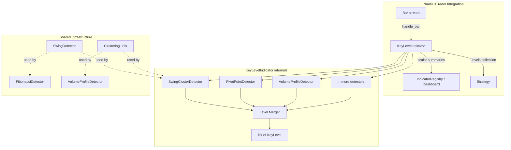

# Key Levels Indicator System

**Trello:** TBD
**Date:** 2026-03-28

## Overview

A plugin-based indicator system that detects horizontal price levels (support/resistance) through multiple independent detection methods. Each method sees price action through a fundamentally different lens — structural, formulaic, volume-based, time-based, price-action-based, and statistical. All variants share a common output model (`KeyLevel`) and can be composed, compared, and backtested independently.

This is the first indicator for NautilusTrader that outputs a variable-length collection rather than fixed scalar values.

## Goals

1. Implement 20+ detection methods as independent, composable detector plugins
2. Every detector is deterministic: same input bars → same output levels
3. Each indicator instance operates on a single bar type (single timeframe)
4. Levels have strength that evolves as evidence accumulates (bounce count, recency)
5. Levels are zones with upper/lower bounds, not just price lines
6. All variants are backtestable and comparable against each other

## Non-Goals

- Multi-timeframe composition within a single indicator (compose externally)
- Strategy logic (this is indicators only, not trading signals)
- Dashboard visualization of full level collections (future scope — requires new chart rendering and serialization)
- Level 2 / order book methods (ASX extension, documented separately)
- Level deduplication across detectors — multiple detectors finding the same price is confluence, not redundancy

## Design Decisions

### Classes vs Pure Functions

The project CLAUDE.md says "NO classes except Pydantic models." This spec uses classes for:
- `KeyLevelIndicator(Indicator)` — **unavoidable**, NautilusTrader's Cython `Indicator` base class requires subclassing
- Detector classes — chosen for type safety and composability per `feedback_python_architecture.md` ("use best architecture for type safety/composability, classes OK")

All data types (KeyLevel, SourceMeta variants, Swing) are frozen dataclasses (data, not behavior). The `KeyLevelDetector` Protocol enforces the contract. This is the minimal use of classes that maximizes type safety.

### Cross-Detector Strength Comparability

Each detector normalizes strength to 0.0-1.0 using its own logic. Cross-source strength comparison is **approximate, not absolute** — a 0.8 from VolumeProfile and a 0.8 from SwingCluster mean different things. The merged level list sorted by strength is a convenience for scalar summary properties. Strategies that need precision should use `levels_by_source()` to compare within a single detection method.

### No Timeframe Field on KeyLevel

By design. Each indicator instance operates on one bar type — the timeframe is implicit from which indicator produced the level. External composition is responsible for tracking provenance when merging levels from multiple timeframes.

### Level Confluence Across Detectors

Multiple detectors finding the same price level is expected and valuable. The Level Merger does **not** deduplicate — it concatenates all detector outputs. A strategy can identify confluence by counting distinct `source` values within a price zone.

## Architecture



### Core Components

1. **`KeyLevelIndicator`** — NautilusTrader `Indicator` subclass. Receives bars, dispatches to detectors, merges results, exposes dual output paths.
2. **`KeyLevelDetector`** — Protocol that all detection methods implement. Stateful but deterministic: given the same bar sequence, always produces the same levels.
3. **`KeyLevel`** — Frozen dataclass representing a single detected level with price, strength, zone bounds, and typed metadata.
4. **Shared infrastructure** — Swing detection, clustering utilities, and common helpers shared across detectors.

## Data Model

### KeyLevel

```python
from __future__ import annotations
from dataclasses import dataclass
from datetime import date
from typing import Literal

Source = Literal[
    "swing_cluster",
    "equal_highs_lows",
    "wick_rejection",
    "pivot_standard",
    "pivot_fibonacci",
    "pivot_camarilla",
    "pivot_woodie",
    "pivot_demark",
    "fib_retracement",
    "fib_extension",
    "psychological",
    "atr_volatility",
    "volume_profile",
    "volume_distribution",
    "anchored_vwap",
    "cvd",
    "session_level",
    "periodic_level",
    "opening_range",
    "market_profile_tpo",
    "order_block",
    "fair_value_gap",
    "price_gap",
    "darvas_box",
    "consolidation_zone",
    "ma_confluence",
    "wyckoff_zone",
]


@dataclass(frozen=True)
class KeyLevel:
    price: float            # Center price of the level
    strength: float         # 0.0 to 1.0, normalized within detector
    bounce_count: int       # Times price pivoted at this level
    first_seen_ts: int      # Nanosecond timestamp of first detection
    last_touched_ts: int    # Nanosecond timestamp of most recent touch/pivot
    zone_upper: float       # Upper bound of the zone
    zone_lower: float       # Lower bound of the zone
    source: Source          # Which detector produced this level
    meta: SourceMeta        # Typed, detector-specific metadata (see below)
```

### Typed Metadata (discriminated union, fully frozen)

Each detector type has its own frozen metadata dataclass. No `dict[str, Any]`, no mutation.

```python
@dataclass(frozen=True)
class SwingClusterMeta:
    cluster_radius: float       # Price radius used for clustering
    pivot_indices: tuple[int, ...]  # Bar indices of pivots in this cluster

@dataclass(frozen=True)
class EqualHighsLowsMeta:
    touch_prices: tuple[float, ...]  # Exact prices of each equal high/low
    side: Literal["high", "low"]

@dataclass(frozen=True)
class WickRejectionMeta:
    rejection_count: int
    avg_wick_ratio: float       # Average wick-to-body ratio at this zone

@dataclass(frozen=True)
class PivotPointMeta:
    variant: Literal["standard", "fibonacci", "camarilla", "woodie", "demark"]
    level_name: str             # e.g., "R1", "S2", "PP"
    period_high: float
    period_low: float
    period_close: float

@dataclass(frozen=True)
class FibonacciMeta:
    ratio: float                # e.g., 0.382, 0.618
    swing_high: float
    swing_low: float
    direction: Literal["retracement", "extension"]

@dataclass(frozen=True)
class PsychologicalMeta:
    tier: Literal["major", "minor", "micro"]  # 00 > 50 > 25
    round_value: float          # The exact round number

@dataclass(frozen=True)
class AtrVolatilityMeta:
    atr_value: float
    multiplier: float
    anchor_price: float         # Price the level is measured from

@dataclass(frozen=True)
class VolumeProfileMeta:
    volume_concentration: float  # % of total volume at this level
    node_type: Literal["poc", "hvn", "lvn", "va_high", "va_low"]
    bin_volume: float

@dataclass(frozen=True)
class VolumeDistributionMeta:
    """Context-aware volume distribution — most popular price by volume
    within a structural context (consolidation range, peak formation, etc.)."""
    context: Literal["consolidation", "peak", "trough", "range"]
    volume_concentration: float
    context_bar_count: int      # Number of bars in the structural context

@dataclass(frozen=True)
class AnchoredVwapMeta:
    anchor_ts: int              # Timestamp of anchor event
    anchor_type: Literal["swing_high", "swing_low", "gap", "volume_spike"]
    cumulative_volume: float

@dataclass(frozen=True)
class CvdMeta:
    cvd_value: float            # CVD at this level
    divergence: Literal["bullish", "bearish", "none"]

@dataclass(frozen=True)
class SessionLevelMeta:
    session: Literal["asian", "london", "new_york", "custom"]
    level_type: Literal["high", "low"]
    session_date: date          # Date of the session

@dataclass(frozen=True)
class PeriodicLevelMeta:
    period: Literal["daily", "weekly", "monthly"]
    level_type: Literal["high", "low", "close"]
    period_start: date          # Start date of the period

@dataclass(frozen=True)
class OpeningRangeMeta:
    range_minutes: int          # Duration of opening range (5, 15, 30, 60)
    level_type: Literal["high", "low"]

@dataclass(frozen=True)
class MarketProfileMeta:
    tpo_count: int              # Number of time periods at this price
    node_type: Literal["poc", "va_high", "va_low"]
    total_tpo_periods: int

@dataclass(frozen=True)
class OrderBlockMeta:
    side: Literal["bullish", "bearish"]
    displacement_atr_multiple: float  # How impulsive was the move
    block_open: float
    block_close: float

@dataclass(frozen=True)
class FairValueGapMeta:
    side: Literal["bullish", "bearish"]
    gap_size: float
    fill_percentage: float      # 0.0 to 1.0, how much has been filled

@dataclass(frozen=True)
class PriceGapMeta:
    gap_type: Literal["breakaway", "runaway", "exhaustion", "common"]
    gap_size: float
    fill_percentage: float
    level_type: Literal["upper", "lower"]

@dataclass(frozen=True)
class DarvasBoxMeta:
    box_top: float
    box_bottom: float
    confirmed: bool
    bars_in_box: int

@dataclass(frozen=True)
class ConsolidationZoneMeta:
    range_high: float
    range_low: float
    slope: float                # Near-zero for horizontal range
    bar_count: int              # Duration of consolidation

@dataclass(frozen=True)
class MaConfluenceMeta:
    converging_periods: tuple[int, ...]  # e.g., (50, 100, 200)
    spread_percent: float       # How tight the confluence is

@dataclass(frozen=True)
class WyckoffZoneMeta:
    phase: Literal["accumulation", "distribution"]
    event: Literal["sc", "ar", "st", "spring", "upthrust", "sos", "lpsy"]
    zone_high: float
    zone_low: float

SourceMeta = (
    SwingClusterMeta
    | EqualHighsLowsMeta
    | WickRejectionMeta
    | PivotPointMeta
    | FibonacciMeta
    | PsychologicalMeta
    | AtrVolatilityMeta
    | VolumeProfileMeta
    | VolumeDistributionMeta
    | AnchoredVwapMeta
    | CvdMeta
    | SessionLevelMeta
    | PeriodicLevelMeta
    | OpeningRangeMeta
    | MarketProfileMeta
    | OrderBlockMeta
    | FairValueGapMeta
    | PriceGapMeta
    | DarvasBoxMeta
    | ConsolidationZoneMeta
    | MaConfluenceMeta
    | WyckoffZoneMeta
)
```

## Detector Protocol

```python
from typing import Protocol

class KeyLevelDetector(Protocol):
    @property
    def name(self) -> Source: ...

    @property
    def warmup_bars(self) -> int:
        """Minimum bars needed before this detector can produce levels."""
        ...

    def update(self, bar: Bar) -> None:
        """Ingest a new bar and update internal state."""
        ...

    def levels(self) -> list[KeyLevel]:
        """Return all currently active levels."""
        ...

    def reset(self) -> None:
        """Reset all internal state."""
        ...
```

Each detector:
- Maintains its own internal state (deques, counters, etc.)
- Is deterministic: given the same sequence of bars, always returns the same levels
- Normalizes its own `strength` values to 0.0-1.0
- Defines zone width using its own logic (ATR-based, cluster spread, fixed tolerance, etc.)
- Must enforce internal memory bounds (e.g., max active levels, deque maxlens)

## KeyLevelIndicator (NautilusTrader Integration)

```python
class KeyLevelIndicator(Indicator):
    """NautilusTrader indicator that composes multiple KeyLevelDetectors.

    Dual output paths:
    - .levels -> list[KeyLevel] for strategy consumption
    - Scalar summary properties for dashboard/registry integration
    """

    def __init__(self, detectors: list[KeyLevelDetector]):
        # Pass detector names as params for meaningful string representation
        # This ensures different detector configurations have distinct names
        super().__init__([d.name for d in detectors])
        self._detectors = detectors
        self._levels: list[KeyLevel] = []
        self._current_price: float = 0.0
        self._bar_count: int = 0
        self._max_warmup: int = max(
            (d.warmup_bars for d in detectors), default=0
        )

    def handle_bar(self, bar: Bar) -> None:
        self._set_has_inputs(True)
        self._bar_count += 1
        self._current_price = float(bar.close)

        for detector in self._detectors:
            detector.update(bar)

        # Merge all detector levels (no deduplication — confluence is signal)
        self._levels = []
        for detector in self._detectors:
            self._levels.extend(detector.levels())

        # Sort by strength descending
        self._levels.sort(key=lambda l: l.strength, reverse=True)

        # Initialize once all detectors have seen enough bars
        if not self.initialized and self._bar_count >= self._max_warmup:
            self._set_initialized(True)

    # -- Full collection output (for strategies) --

    @property
    def levels(self) -> list[KeyLevel]:
        return self._levels

    def levels_above(self, price: float) -> list[KeyLevel]:
        return [l for l in self._levels if l.price > price]

    def levels_below(self, price: float) -> list[KeyLevel]:
        return [l for l in self._levels if l.price < price]

    def levels_by_source(self, source: Source) -> list[KeyLevel]:
        return [l for l in self._levels if l.source == source]

    # -- Scalar summary outputs (for dashboard registry) --

    @property
    def nearest_support(self) -> float:
        """Closest level below current price (by price proximity, not strength)."""
        below = self.levels_below(self._current_price)
        if not below:
            return float("nan")
        return max(below, key=lambda l: l.price).price

    @property
    def nearest_resistance(self) -> float:
        """Closest level above current price (by price proximity, not strength)."""
        above = self.levels_above(self._current_price)
        if not above:
            return float("nan")
        return min(above, key=lambda l: l.price).price

    @property
    def strongest_support(self) -> float:
        """Strongest level below current price (by strength)."""
        below = self.levels_below(self._current_price)
        return below[0].price if below else float("nan")  # Already sorted by strength

    @property
    def strongest_resistance(self) -> float:
        """Strongest level above current price (by strength)."""
        above = self.levels_above(self._current_price)
        return above[0].price if above else float("nan")  # Already sorted by strength

    @property
    def level_count(self) -> float:
        return float(len(self._levels))

    def _reset(self) -> None:
        for detector in self._detectors:
            detector.reset()
        self._levels = []
        self._current_price = 0.0
        self._bar_count = 0
```

### Dashboard Integration

The existing `compute_indicator` pipeline calls `config.update(indicator, bar)` which invokes `indicator.update_raw(h, l, c)`. `KeyLevelIndicator` needs the full `Bar` object via `handle_bar`. This requires a new update function:

```python
# New update function in store/indicators.py
def update_bar(indicator: IndicatorProto, bar: Bar) -> None:
    """Pass the full Bar object to indicators that need it (e.g., KeyLevelIndicator).
    Calls handle_bar instead of update_raw."""
    indicator.handle_bar(bar)  # type: ignore[attr-defined]
```

Registry entry:

```python
# Future registry entry (not part of initial implementation)
"KeyLevels_swing_cluster": IndicatorConfig(
    indicator_class=KeyLevelIndicator,
    params=(),
    outputs=("nearest_support", "nearest_resistance", "strongest_support", "strongest_resistance", "level_count"),
    display="overlay",
    label="Key Levels (Swing Cluster)",
    update=update_bar,  # Uses handle_bar, not update_raw
    kwargs={"detectors": [SwingClusterDetector(period=20)]},
)
```

Full level visualization (rendering all levels as horizontal zones on the chart) is future scope requiring a new API endpoint, JSON serialization of `list[KeyLevel]` with heterogeneous `SourceMeta`, and a new eCharts rendering mode for horizontal zones.

## Detection Methods — All Variants

### Tier 1: Structural (price structure analysis)

#### 1. SwingClusterDetector
Detect fractal swing highs/lows (Williams fractals with configurable N), then cluster nearby pivots using agglomerative clustering. Each cluster becomes a level. Strength = normalized bounce count weighted by recency (exponential decay).

**Parameters:** `period` (fractal lookback N), `cluster_distance` (ATR multiple for merge threshold), `recency_decay` (half-life in bars)
**Update function:** `update_hlc` (needs high, low for swing detection; close for ATR)
**Zone width:** Cluster spread (min to max of clustered pivot prices)
**Warmup:** `2 * period + 1` bars

#### 2. EqualHighsLowsDetector
After swing detection, scan for N swing highs (or lows) within a tolerance of each other. Tolerance is ATR-based.

**Parameters:** `period` (swing detection), `tolerance_atr_multiple`, `min_touches` (minimum equal touches to form a level)
**Update function:** `update_hlc`
**Zone width:** Tolerance band around the mean of equal prices
**Warmup:** Same as swing detection

#### 3. WickRejectionDetector
Identify bars with long wicks relative to body. Group rejections by price zone. Multiple rejections in the same zone form a level.

**Parameters:** `min_wick_ratio` (wick length / body length threshold), `zone_atr_multiple` (grouping tolerance), `min_rejections`
**Update function:** `update_hlc` (needs full OHLC for wick calculation)
**Zone width:** Range of wick tips in the cluster
**Warmup:** 1 bar (stateless per bar, but needs accumulation for grouping)

### Tier 2: Formulaic (mathematical derivation)

#### 4. PivotPointDetector (5 variants via parameter)
Calculate pivot levels from prior completed period OHLC. Variant parameter selects formula:
- **Standard:** PP = (H+L+C)/3, R1/S1 from PP, R2/S2 from range
- **Fibonacci:** PP + Fibonacci ratios * range
- **Camarilla:** Close +/- range * multipliers (4 levels per side)
- **Woodie:** PP = (H+L+2C)/4
- **DeMark:** Conditional on Open vs Close relationship

**Parameters:** `variant` (Literal), `period_bars` (how many bars constitute a "period" — e.g., number of bars in a daily session for intraday pivots)
**Update function:** `update_hlc` (needs H, L, C; DeMark also needs O via full bar)
**Zone width:** Fixed ATR-fraction or tick-based tolerance
**Warmup:** `period_bars` (needs one complete period)

#### 5. FibonacciRetracementDetector
Detect the most recent significant swing high and swing low (ATR-filtered), then calculate retracement levels at 23.6%, 38.2%, 50%, 61.8%, 78.6%.

**Parameters:** `swing_period`, `min_swing_atr_multiple` (minimum swing size as ATR multiple)
**Update function:** `update_hlc`
**Zone width:** Small ATR-fraction tolerance
**Warmup:** `swing_period * 2 + 1`

#### 6. FibonacciExtensionDetector
Given three points (swing A, swing B, retracement C), project extension levels at 100%, 127.2%, 161.8%, 200%, 261.8% beyond C.

**Parameters:** `swing_period`, `min_swing_atr_multiple`
**Update function:** `update_hlc`
**Zone width:** Small ATR-fraction tolerance
**Warmup:** Needs at least 3 confirmed swings

#### 7. PsychologicalLevelDetector
Generate levels at round numbers relative to current price. Tier definitions are instrument-dependent and configured via a `tier_steps` parameter that maps tier names to price step sizes:

- XAUUSD: `{"major": 100.0, "minor": 50.0, "micro": 25.0}` → 2000, 2050, 2025
- EURUSD: `{"major": 0.01, "minor": 0.005, "micro": 0.0025}` → 1.0500, 1.0550, 1.0525
- ASX200: `{"major": 100, "minor": 50, "micro": 25}` → 8000, 8050, 8025

Strength is tier-based (major > minor > micro) and boosted when price has historically reacted at the level (tracked via bounce counting).

**Parameters:** `tier_steps` (dict of tier name → price step size, instrument-dependent), `lookback` (bars to scan for historical reactions), `range_levels` (how many levels above/below current price to generate)
**Update function:** `update_hlc`
**Zone width:** Fixed tick-based tolerance
**Warmup:** 0 (levels exist immediately from price alone, but bounce counting needs history)

#### 8. AtrVolatilityDetector
Levels at ATR multiples from current close or from swing anchors.

**Parameters:** `atr_period`, `multipliers` (tuple of floats, e.g., (1.0, 1.5, 2.0, 3.0))
**Update function:** `update_hlc`
**Zone width:** Proportional to ATR
**Warmup:** `atr_period`

### Tier 3: Volume-Based

#### 9. VolumeProfileDetector
Discretize price range into bins, accumulate volume per bin. Output POC, HVN, LVN, Value Area High, Value Area Low.

**Parameters:** `lookback_bars`, `bin_count` (number of price bins), `value_area_pct` (default 0.7)
**Update function:** Full bar (needs H, L, C, V for proportional volume allocation)
**Zone width:** Bin width
**Warmup:** `lookback_bars`

#### 10. VolumeDistributionDetector
Context-aware volume profile — find the most popular price by volume within a detected structural context (consolidation range, peak formation, channel). Unlike the generic VolumeProfileDetector which uses a fixed lookback window, this one identifies structural contexts first, then computes volume distribution within each context.

**Parameters:** `swing_period` (for structure detection), `min_context_bars`, `bin_count`
**Update function:** Full bar (H, L, C, V)
**Zone width:** Determined by the structural context bounds
**Warmup:** `swing_period * 2 + min_context_bars`

#### 11. AnchoredVwapDetector
Calculate VWAP anchored to significant events (swing highs, swing lows, gaps, volume spikes). Each anchor produces a dynamic level that updates every bar.

**Parameters:** `swing_period`, `max_anchors` (limit number of concurrent VWAPs)
**Update function:** Full bar (needs typical price and volume)
**Zone width:** Optional standard deviation bands (1 sigma)
**Warmup:** `swing_period`

#### 12. CvdDetector
Estimate buy/sell volume split per bar. Track cumulative volume delta. Detect CVD pivots (swing highs/lows on CVD itself). CVD pivots at specific price levels indicate exhaustion.

**Buy/sell estimation from OHLCV:** `buy_volume = volume * (close - low) / (high - low)` when close > open (reversed when close < open). This is an approximation — accuracy depends on the instrument and timeframe. Works reasonably well on higher timeframes (1H+) where the close-to-range ratio is a decent proxy for aggression direction. Less reliable on tick-level data. The estimation method should be documented as a known limitation.

**Parameters:** `swing_period` (for CVD pivot detection)
**Update function:** Full bar (needs O, H, L, C, V for buy/sell estimation)
**Zone width:** ATR-based tolerance
**Warmup:** `swing_period * 2`

### Tier 4: Time-Based

#### 13. SessionLevelDetector
Track high and low of defined trading sessions (Asian, London, New York, or custom). Previous session's high/low become levels. Session boundaries are defined in UTC; the detector converts bar timestamps (nanosecond UTC) to determine which session a bar belongs to.

**Parameters:** `sessions` (dict of session name → (start_hour_utc, end_hour_utc)), `exchange_timezone` (str, e.g., "Australia/Sydney" for ASX — used to handle DST-aware session boundaries where needed)
**Update function:** Full bar (needs H, L, timestamp)
**Zone width:** Minimal (exact high/low)
**Warmup:** One complete session

#### 14. PeriodicLevelDetector
Previous period high, low, close for daily, weekly, monthly timeframes. These are static levels that update at period boundaries. Period boundaries use the exchange timezone to determine day/week/month rollover.

**Parameters:** `periods` (which periods to track: daily, weekly, monthly), `exchange_timezone` (str)
**Update function:** Full bar (needs H, L, C, timestamp)
**Zone width:** Minimal (exact prices)
**Warmup:** One complete period

#### 15. OpeningRangeDetector
Record high and low of the first N minutes after market open. Market open time is specified in the exchange's local timezone.

**Parameters:** `range_minutes` (5, 15, 30, or 60), `market_open_hour_utc`, `exchange_timezone` (str)
**Update function:** Full bar (needs H, L, timestamp)
**Zone width:** Minimal (exact high/low)
**Warmup:** `range_minutes` worth of bars

#### 16. MarketProfileDetector (TPO)
Divide session into 30-minute time slices. Record which price bins were visited in each slice. POC = most visited bin. Value Area = 70% of TPOs centered on POC.

**Parameters:** `slice_minutes` (default 30), `bin_count`, `value_area_pct` (default 0.7)
**Update function:** Full bar (needs H, L, timestamp)
**Zone width:** Bin width
**Warmup:** One complete session

### Tier 5: Price Action / Smart Money

#### 17. OrderBlockDetector
Find the last opposing candle before an impulsive move (> ATR threshold). The candle's open-to-close range is the zone. Validity strengthened by subsequent break of structure.

**Parameters:** `atr_period`, `displacement_threshold` (ATR multiple for "impulsive"), `max_age_bars` (expire old blocks)
**Update function:** Full bar (needs O, H, L, C for candle body + ATR)
**Zone width:** Order block candle's open-to-close range
**Warmup:** `atr_period + 1`

#### 18. FairValueGapDetector
Three-bar pattern: gap between bar[0].low and bar[2].high (bullish) or bar[0].high and bar[2].low (bearish). Track fill percentage as price revisits.

**Parameters:** `min_gap_atr_multiple` (minimum gap size filter), `max_age_bars`
**Update function:** Full bar (needs H, L)
**Zone width:** The gap itself (bar[2].high to bar[0].low or vice versa)
**Warmup:** 3 bars

#### 19. PriceGapDetector
Detect inter-bar gaps (current bar.low > previous bar.high, or vice versa). Classify by type (breakaway, runaway, exhaustion, common) using volume and trend context. Track fill percentage.

**Parameters:** `min_gap_atr_multiple`, `volume_period` (for classification), `max_age_bars`
**Update function:** Full bar (needs H, L, V, timestamp)
**Zone width:** Gap edges
**Warmup:** `volume_period` (for classification baseline)

#### 20. DarvasBoxDetector
When price makes a new N-period high, wait for 3 bars that don't exceed it (confirmed top). The lowest low during consolidation is the box bottom. Box top and bottom are levels.

**Parameters:** `lookback_period` (for new high detection), `confirmation_bars` (default 3)
**Update function:** `update_hlc`
**Zone width:** Full box range (top to bottom)
**Warmup:** `lookback_period + confirmation_bars`

#### 21. ConsolidationZoneDetector
Detect horizontal trading ranges via near-zero slope of linear regression on highs and lows, combined with volatility compression (ATR or BB width below threshold). Upper and lower boundaries become levels.

**Parameters:** `min_range_bars`, `max_slope` (absolute slope threshold), `volatility_threshold`
**Update function:** `update_hlc`
**Zone width:** Range boundaries
**Warmup:** `min_range_bars`

### Tier 6: Composite / Statistical

#### 22. MaConfluenceDetector
Calculate multiple EMAs/SMAs. When N or more converge within a tight band (spread < threshold), the confluence zone acts as a level.

**Parameters:** `ma_periods` (tuple of periods, e.g., (9, 21, 50, 100, 200)), `min_converging` (minimum MAs in band), `spread_threshold` (ATR multiple)
**Update function:** `update_close`
**Zone width:** Spread of converging MAs
**Warmup:** `max(ma_periods)`

#### 23. WyckoffZoneDetector
Detect Wyckoff accumulation/distribution schematics by identifying the event sequence: selling climax, automatic rally, secondary test, spring/upthrust. The SC-to-AR range defines the zone.

**Complexity note:** This is the most complex detector — full Wyckoff schematic detection involves ambiguous multi-bar pattern recognition. The initial implementation should focus on detecting individual Wyckoff events (selling climax = high-volume sharp drop, spring = brief break below support on low volume) rather than the complete schematic sequence. A detailed sub-spec is required before implementation.

**Parameters:** `volume_period` (for volume analysis), `swing_period`
**Update function:** Full bar (needs O, H, L, C, V)
**Zone width:** The accumulation/distribution range
**Warmup:** `volume_period + swing_period`

## Shared Infrastructure

### SwingDetector (internal helper, not a KeyLevelDetector)
Williams fractal swing detection with configurable lookback N. Used by: SwingClusterDetector, EqualHighsLowsDetector, FibonacciRetracementDetector, FibonacciExtensionDetector, AnchoredVwapDetector, CvdDetector, VolumeDistributionDetector.

```python
@dataclass(frozen=True)
class Swing:
    price: float
    bar_index: int
    ts: int                     # Nanosecond timestamp
    side: Literal["high", "low"]

class SwingDetector:
    def __init__(self, period: int): ...
    def update(self, high: float, low: float, bar_index: int, ts: int) -> Swing | None: ...
    def swings(self) -> list[Swing]: ...
    def reset(self) -> None: ...
```

### Clustering utilities
Agglomerative clustering for grouping nearby price levels. Used by: SwingClusterDetector, EqualHighsLowsDetector, WickRejectionDetector.

### ATR helper
Streaming ATR calculation used by many detectors for adaptive thresholds and zone widths.

## Strength Normalization

Each detector normalizes its own strength to 0.0-1.0 using logic appropriate to its detection method:

| Detector | Strength basis |
|----------|---------------|
| SwingCluster | bounce_count / max_bounce_count, weighted by recency decay |
| EqualHighsLows | touch_count / max_touch_count |
| WickRejection | rejection_count * avg_wick_ratio, normalized |
| PivotPoints | Fixed by level proximity to PP (PP=1.0, R1/S1=0.8, R2/S2=0.6, etc.) |
| Fibonacci | Fixed by ratio (61.8%=1.0, 50%=0.8, 38.2%=0.6, 23.6%=0.4) |
| Psychological | By tier (major=1.0, minor=0.6, micro=0.3) + historical bounce boost |
| AtrVolatility | By multiplier (1x=0.5, 2x=0.7, 3x=1.0 — further = stronger barrier) |
| VolumeProfile | volume_at_level / max_volume_at_any_level |
| VolumeDistribution | volume_concentration within context |
| AnchoredVwap | Recency of anchor + volume-weighted significance |
| CVD | Magnitude of CVD divergence at the level |
| Session/Periodic/OR | Fixed (all session levels equally strong; recency could boost) |
| MarketProfile | tpo_count / max_tpo_count |
| OrderBlock | displacement_atr_multiple, decaying over time |
| FVG | gap_size * (1 - fill_percentage) |
| PriceGap | gap_type dependent (breakaway=1.0, common=0.3) * (1 - fill_pct) |
| DarvasBox | Duration of consolidation (more bars = stronger box) |
| ConsolidationZone | bar_count * inverse_slope (longer + flatter = stronger) |
| MaConfluence | Number of converging MAs * inverse_spread |
| Wyckoff | Phase completeness (more events confirmed = stronger) |

## Level Lifecycle and Memory Management

Levels are not permanent. Each detector manages its own level lifecycle:

1. **Creation:** Level detected for the first time
2. **Strengthening:** Price revisits the level, bounce_count increments, last_touched_ts updates
3. **Weakening/Expiry:** Detectors that support it use time-based decay or a `max_age_bars` parameter. After expiry, the level is removed from the detector's output.

**Memory bounds:** Each detector internally uses bounded collections (deques with maxlen for swing history, capped level lists, etc.). The total number of active levels across all detectors is bounded by detector design, not by an arbitrary global cap.

## Level 2 / Order Book Extension (ASX)

When Level 2 data is available (e.g., ASX instruments via IB), two additional detectors become possible:

### OrderBookDepthDetector (future)
Identify price levels with unusually large resting limit orders. Large bid walls indicate support; large ask walls indicate resistance. Requires streaming order book snapshots.

**Unique insight:** Forward-looking — sees supply/demand before it manifests in price. The only method that detects levels from current market state rather than historical price action.

**Inputs:** Level 2 order book snapshots (not OHLCV bars)
**Challenge:** Requires a different data ingestion path (not handle_bar). Would need handle_quote_tick or a custom data handler.

### LiquidationHeatmapDetector (future)
Estimate where liquidation cascades would occur based on open interest and leverage tiers. Zones with high liquidation density act as price magnets.

**Inputs:** Open interest data, funding rates, leverage distribution estimates.
**Challenge:** Requires external data sources beyond NautilusTrader's standard feeds.

These detectors would follow the same `KeyLevelDetector` protocol but would receive data through a different channel. The `KeyLevelIndicator` would need to support multiple data input types, or these could be separate indicator instances that feed into external composition.

## File Structure

The existing `packages/server/server/store/indicators.py` is expanded into a package. The existing registry code moves to `registry.py`; the new key levels system lives alongside it.

```
packages/server/server/store/indicators/
    __init__.py                     # Re-exports from registry.py for backwards compat
    registry.py                     # Existing INDICATOR_REGISTRY, compute_indicator, etc.
    key_levels/
        __init__.py
        model.py                    # KeyLevel, SourceMeta types, Source literal
        detector.py                 # KeyLevelDetector protocol
        indicator.py                # KeyLevelIndicator (NautilusTrader integration)
        shared/
            __init__.py
            swing.py                # SwingDetector helper
            clustering.py           # Agglomerative clustering utility
            atr.py                  # Streaming ATR helper
            bar_factory.py          # Test utility for creating NautilusTrader Bar objects
        detectors/
            __init__.py
            structural/
                __init__.py
                swing_cluster.py
                equal_highs_lows.py
                wick_rejection.py
            formulaic/
                __init__.py
                pivot_points.py     # All 5 variants via parameter
                fibonacci.py        # Both retracement and extension
                psychological.py
                atr_volatility.py
            volume/
                __init__.py
                volume_profile.py
                volume_distribution.py
                anchored_vwap.py
                cvd.py
            time_based/
                __init__.py
                session_levels.py
                periodic_levels.py
                opening_range.py
                market_profile.py
            price_action/
                __init__.py
                order_blocks.py
                fair_value_gaps.py
                price_gaps.py
                darvas_box.py
                consolidation_zone.py
            composite/
                __init__.py
                ma_confluence.py
                wyckoff_zone.py
packages/server/tests/
    test_key_levels/
        __init__.py
        conftest.py                 # Shared fixtures: bar_factory, common bar sequences
        test_model.py
        test_indicator.py
        test_shared/
            test_swing.py
            test_clustering.py
        test_detectors/
            test_swing_cluster.py
            test_equal_highs_lows.py
            ... (one test file per detector)
```

## Testing Strategy

### Test Utilities

A `bar_factory` module provides helpers for creating NautilusTrader `Bar` objects from simple numeric inputs. `Bar` objects require `BarType`, `Price`, `Quantity` objects — the factory abstracts this away for tests:

```python
def make_bar(open: float, high: float, low: float, close: float,
             volume: float = 100.0, ts_ns: int = 0) -> Bar: ...

def make_bars_from_closes(closes: list[float], spread: float = 0.5) -> list[Bar]: ...

def make_bars_from_ohlcv(data: list[tuple[float, float, float, float, float]]) -> list[Bar]: ...
```

### Test Categories

1. **Unit tests per detector:** Feed known bar sequences, assert expected levels with exact prices, strengths, and metadata. Each detector gets its own test file with specific scenarios that exercise its detection logic.

2. **Determinism tests:** Feed same bars twice to two fresh instances, assert identical output. This is the core requirement — every test implicitly validates determinism.

3. **Reset tests:** Feed bars, reset, feed same bars, assert identical output to a fresh instance. Verifies `reset()` fully clears state.

4. **Edge cases:** Empty bars, single bar, all flat prices (high == low == close), extreme volatility (100x ATR moves), zero volume bars.

5. **Property-based invariant tests:** Using `hypothesis`, verify across random bar sequences:
   - `zone_lower <= price <= zone_upper` for every level
   - `0.0 <= strength <= 1.0`
   - `first_seen_ts <= last_touched_ts`
   - `bounce_count >= 0`
   - Level count is bounded (does not grow unboundedly with bar count)

6. **Golden-file snapshot tests:** For complex detectors (SwingCluster, VolumeProfile, Wyckoff), commit known bar sequences and expected level outputs as JSON fixtures. Tests assert exact match. Any change to detector logic that changes output must update the fixture (intentional regression gate).

7. **Integration test:** Compose multiple detectors in KeyLevelIndicator, verify merged output, scalar summary properties, and `levels_by_source` filtering.

8. **Registry integration test:** Verify `KeyLevelIndicator` works end-to-end through the `compute_indicator` pipeline with the `update_bar` function, producing valid `IndicatorResult` with scalar summaries.

9. **Memory bound tests:** Feed 10,000+ bars, verify total active levels across all detectors stays below a reasonable bound. No unbounded growth.

10. **Performance benchmark:** Time the full pipeline (all detectors) over 10,000 bars. Not a pass/fail test, but a tracked metric to catch regressions.

## Implementation Order

Given the scale (23 detectors), implementation should be phased:

**Phase 1 — Core + Structural (foundation)**
- KeyLevel model, KeyLevelDetector protocol, KeyLevelIndicator
- Shared infrastructure (SwingDetector, clustering, ATR helper)
- SwingClusterDetector, EqualHighsLowsDetector, WickRejectionDetector
- Tests for all of the above

**Phase 2 — Formulaic (quick wins, simple math)**
- PivotPointDetector (all 5 variants)
- PsychologicalLevelDetector
- AtrVolatilityDetector
- FibonacciRetracementDetector, FibonacciExtensionDetector

**Phase 3 — Volume-Based**
- VolumeProfileDetector
- VolumeDistributionDetector
- AnchoredVwapDetector
- CvdDetector

**Phase 4 — Time-Based**
- SessionLevelDetector, PeriodicLevelDetector, OpeningRangeDetector
- MarketProfileDetector

**Phase 5 — Price Action / Smart Money**
- OrderBlockDetector, FairValueGapDetector, PriceGapDetector
- DarvasBoxDetector, ConsolidationZoneDetector

**Phase 6 — Composite**
- MaConfluenceDetector, WyckoffZoneDetector

**Phase 7 — Dashboard Integration**
- Register KeyLevelIndicator variants in IndicatorRegistry with scalar summaries
- New API endpoint for full level data (future)
- Chart rendering for level zones (future)
